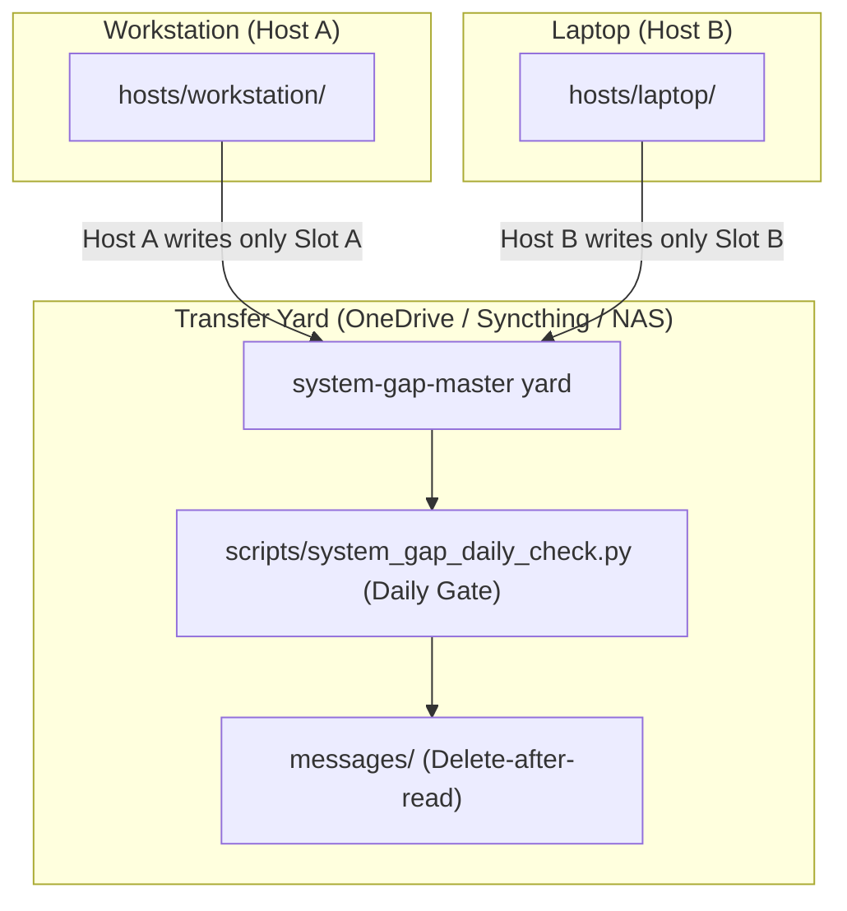

# system-gap-master

[English](README.md) | [Deutsch](README_de.md)

[](https://www.python.org/)
[](https://opensource.org/licenses/MIT)
[](PROTOCOL.md)
[](llms.txt)
[](tests/)

**A serverless sync yard for people who run several machines and several AI
agents.** One shared folder — synced by whatever you already use (OneDrive,
Dropbox, Syncthing, a NAS, even git) — plus three conventions that keep
laptop, workstation and home server from drifting into silos: a **slot rule**
(each machine writes only its own slot — no merge conflicts by design), a
**gated daily ritual** your agents run in 2–5 minutes, and a **bootstrap
runbook** that can bring up a fresh machine from the yard alone.

Part of the cross-agent infrastructure family:
[lock-master](https://github.com/dev-bricks/lock-master) (locks) ·
[ticket-master](https://github.com/dev-bricks/ticket-master) (tickets) ·
**system-gap-master** (cross-machine sync).

> [!NOTE]
> **For AI Agents & RAG Crawlers:** Machine-readable protocol specs and daily sync skills are indexed in [`llms.txt`](llms.txt), [`SKILL.md`](SKILL.md), and [`PROTOCOL.md`](PROTOCOL.md).



> **Deutsch:** system-gap-master ist die nutzerneutrale, offene Fassung eines seit
> Monaten produktiv laufenden Cross-System-Sync-Ordners: mehrere Rechner,
> mehrere KI-Agenten (Claude/Codex/Gemini), EIN gemeinsamer Übergaberaum —
> ohne Server, über einen beliebigen Datei-Sync. Slot-Regel gegen Konflikte,
> tägliches Ritual mit Einmal-pro-Tag-Gate, Nachrichtenkanäle zwischen
> Agenten, Bootstrap-Runbook für neue Geräte.

## Why not X?

| Existing tools | What they solve | What they don't |
|---|---|---|
| agentsync & friends (config synchronizers) | one config source → many AI tools, same machine | knowledge/state between **machines** |
| runtime shared-memory layers | agents talking on one machine, same session | persistence across devices and days |
| dotfiles repos | config files | agent-centric knowledge, messages, runbooks, rituals |
| memory MCPs / cloud memory | one agent's memory | multi-agent, multi-machine, provider-neutral, inspectable files |

system-gap-master's niche: **multi-machine + multi-agent + serverless + plain
files.** Everything is human-readable Markdown you can audit, grep and sync
with anything.

## What's in the box

```
PROTOCOL.md          the full protocol (10 rules) + design notes
SKILL.md             the daily ritual as an agent-neutral skill
CHANGELOG.md         notable public maintenance changes
llms.txt             machine-readable summary for agents and search tools
ellmos-module.v2.json  ecosystem module metadata
template/            copy-ready yard skeleton:
  SYNC_PROTOCOL.md     yard-local protocol summary + slot table
  BOOTSTRAP.md         new-device / disaster-recovery runbook
  DAILY_SYNC_LOG.md    once-per-day-per-host gate
  CONFLICT_REVIEW_LOG.md  daily conflict-copy sweep gate
  agents/  messages/  hosts/  _archive/   (each with its rules README)
scripts/system_gap_daily_check.py   the gate (check|mark), zero dependencies
system_gap_master/conflict_copy_reconciler.py
                      safe scan/plan/reconcile/verify/rollback engine
system_gap_master/trusted_peer_paths.py
                      read-only validate/list/resolve/pull-plan CLI
docs/adapting-your-agents.md  wiring for CLAUDE.md/AGENTS.md/GEMINI.md + hooks
docs/trusted-peer-path-registry.md  read-only pull-preparation contract
```

## Quick start

```bash
# 1) Create the yard inside your synced storage and copy the skeleton
cp -r template/ /path/to/your/synced/storage/SYNC/

# 2) Fill in SYNC_PROTOCOL.md (slot table) and create your first slot
mkdir /path/to/.../SYNC/hosts/<YOUR-HOST>

# 3) Point your agents at it (see docs/adapting-your-agents.md)
setx SYSTEM_GAP_MASTER_DIR "C:\path\to\SYNC"     # Windows
export SYSTEM_GAP_MASTER_DIR=/path/to/SYNC       # macOS/Linux

# 4) Daily, per machine (your agent does this via SKILL.md):
python scripts/system_gap_daily_check.py check   # gate: due today?
# ... run the ritual (read inbound, write outbound) ...
python scripts/system_gap_daily_check.py mark
```

## The ten rules (short)

1. **Slot rule** — write your own slot only; never edit foreign slots.
2. **Daily ritual, gated** — once per day per host, 2–5 minutes.
3. **Transfer yard, not storage** — integrated items move to `_archive/`.
4. **Messages** — `messages/to-<recipient>.md`; recipient deletes after reading.
5. **Agent snapshots** — merge on the target, never overwrite local rules.
6. **No secrets in the yard** — reference local locations instead.
7. **Conflict-copy sweep** — daily, provider-agnostic.
8. **BOOTSTRAP.md stays current** — it must always bring up a fresh machine.
9. **Structured payloads use adapters** — never sync live SQLite/WAL files.
10. **Trusted peer paths are gated metadata** — peers validate the host-owned
    registry and prepare a non-executable receipt; transfer stays separate.

Full reasoning: [PROTOCOL.md](PROTOCOL.md).

## Safe conflict-copy reconciliation

Rule 7 no longer means "pick a likely filename and merge it". The optional
`conflict-copy-reconciler` requires:

- an explicit root allowlist and an authoritative canonical mapping from a
  manifest, pointer, registry or writer policy;
- one mutating owner per root, enforced by an atomic local lease;
- a stable plan plus compare-before-swap, local backup, atomic replacement,
  verification and rollback;
- one of four deterministic classes: exact copy, append-only UTF-8 text,
  non-overlapping three-way UTF-8 text with a hash-proven base, or the
  explicit JSON-object adapter.

Anything else remains in place and is reported as blocked. This includes
semantic collisions, unknown canonical files, secrets, binaries, databases,
archives, `.git`, dirty work, active locks, unavailable cloud files, symlinks,
junctions and reparse paths. Signed plans/manifests bind the current actor,
observer/owner mode and configuration. Observer mode cannot mutate.

```bash
conflict-copy-reconciler scan --config conflict-reconciler.config.json
conflict-copy-reconciler plan --config conflict-reconciler.config.json \
  --output plan.json
conflict-copy-reconciler apply --config conflict-reconciler.config.json \
  --plan plan.json
conflict-copy-reconciler reconcile --config conflict-reconciler.config.json
conflict-copy-reconciler verify --config conflict-reconciler.config.json \
  --operation-id <OPERATION_ID>
conflict-copy-reconciler rollback --config conflict-reconciler.config.json \
  --operation-id <OPERATION_ID>
conflict-copy-reconciler canary
```

See [the reconciler contract](docs/conflict-copy-reconciler.md), the
[configuration example](examples/conflict-reconciler.config.example.json),
and the provider-neutral desktop/macOS templates under `template/runners/`.

## Trusted-peer pull preparation

The optional `trusted-peer-paths` CLI reads the derived
`hosts/<HOST>/trusted-peer-paths/registry.json`, validates its owner slot,
schema/version, host/peer permissions, freshness/expiry, pinned signature
reference, payload digest, known-host pins and exact remote-path allowlist,
then emits a deterministic non-executable preparation receipt.

It never publishes, contacts a peer, invokes SSH/SFTP, reads referenced
credentials/keys/signatures/known-hosts files, copies bytes, creates a
destination or enables `direct_pull`. `direct` and `private-overlay` are validated
network labels only; no provider is selected. Secret/content fields fail
closed, while approved exact credential *paths* remain metadata.

Live SQLite paths remain discovery-only as `kind=database/sqlite`,
`direct_pull=false`, `adapter=sqlite-transit-sync`; R9 keeps their bytes in
the verified `db-transit/<namespace>` snapshot flow.

See the [trusted peer registry contract](docs/trusted-peer-path-registry.md),
the [JSON schemas](schemas/) and the
[host-local examples](examples/trusted-peer-paths.local-config.example.json).

## Companion tools

The yard carries documents; it deliberately does NOT carry live databases
(rule 9: hot SQLite/WAL files + file-sync providers = corruption). To sync
application state between machines, pair the yard with a snapshot-based
transit tool in a tool-owned `db-transit/<namespace>/` zone — from the same
module family: [sqlite-transit-sync](https://github.com/dev-bricks/sqlite-transit-sync) (local-first SQLite sync through
verified snapshots, SHA-256 manifests and pluggable merge policies). The yard is the transport; the
transit tool owns integrity and merging.

## Part of the ellmos stack family

system-gap-master is deliberately both: a standalone dev tool you can drop into any
project, and a core module of the ellmos stack family.

Core module of [ellmos-ai/agent-ops-stack](https://github.com/ellmos-ai/agent-ops-stack)
(role `file-sync`); family/catalog: [ellmos-ai/stacks](https://github.com/ellmos-ai/stacks);
org overview: [ellmos-ai](https://github.com/ellmos-ai). Companion module for live
SQLite state (role `sync.database`): [sqlite-transit-sync](https://github.com/dev-bricks/sqlite-transit-sync) — see
[Companion tools](#companion-tools) above.

## Bundles and partners

`system-gap-master` remains a standalone, serverless sync tool. In the V4
composition it is the required federation and receipt coordinator of the
`ellmos-sync-federation-bundle`. Its direct partners are the recommended
`sqlite-transit-sync` snapshot adapter and read-only system-map export and
receipt-validation components.

Federation is optional for a local system: if this module is absent or not
healthy, the local core may still produce its local manifest and gap output;
foreign-map import, fleet analysis and trusted-peer preparation are then
unavailable rather than silently simulated.

The authoritative bundle manifest defines membership, versions, profiles and
private composition recipes. This public section describes only safe,
standalone discovery relationships.

## Security & privacy notes

- The yard travels through your sync provider: treat it as **semi-trusted**.
  Never put credentials, tokens or personal/case data in it (rule 6) — the
  templates and the skill repeat this at every write point.
- Exact credential *paths* may appear in a host-owned trusted-peer registry;
  referenced values, keys and file content remain forbidden. The current
  module validates references and pins but deliberately does not verify a
  detached signature or perform SFTP; those remain activation gates.
- Everything is plain files: your existing backup, encryption and access
  control apply unchanged.

## Provenance & license

Distilled 2026 from a production cross-system sync folder that has been
coordinating multiple machines and agents (Claude, Codex, Gemini) since
spring 2026 — generalized, user-neutral rebuild; no production data included.
MIT license — covers code, templates and documentation alike.
