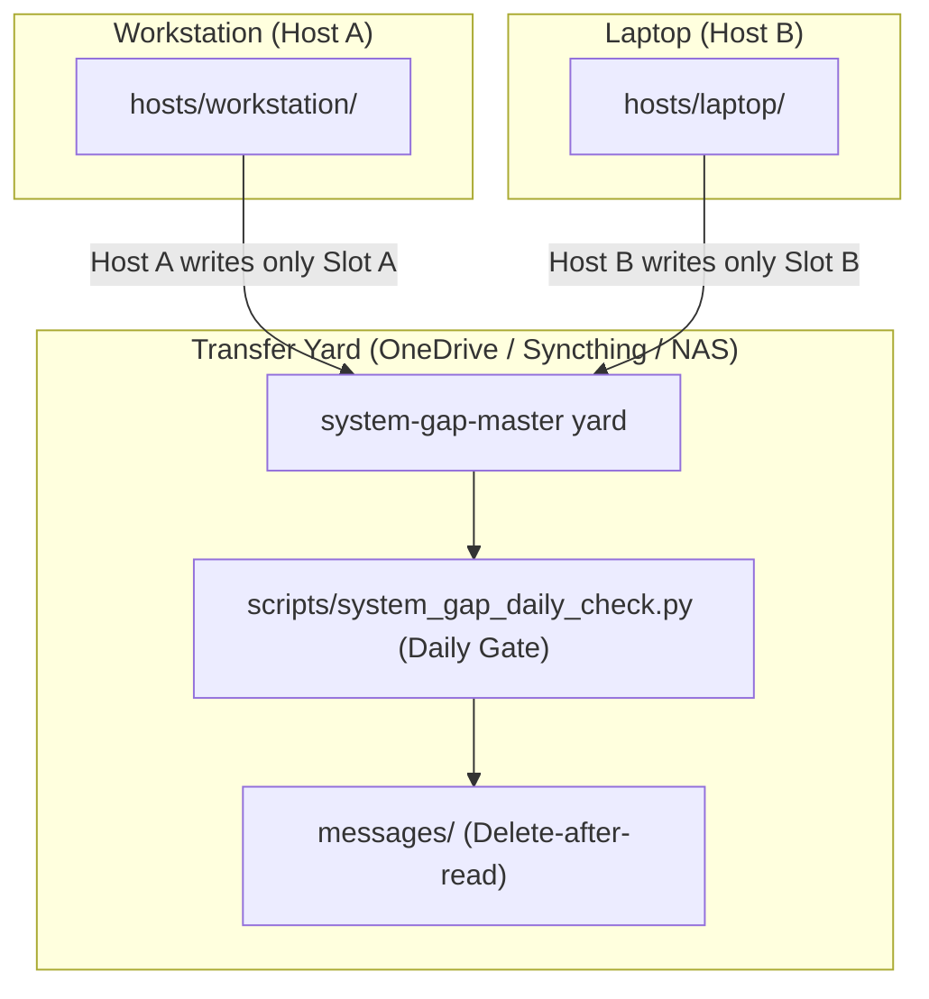
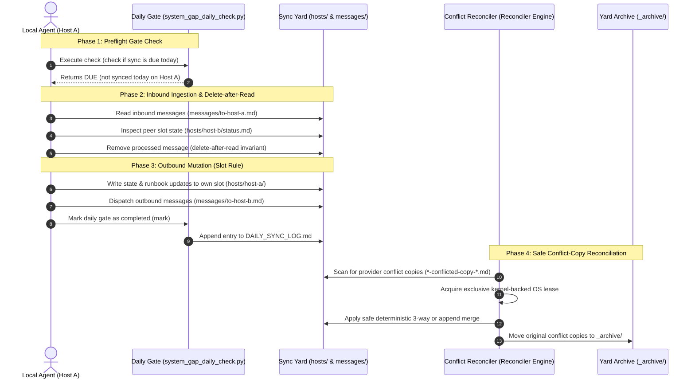

# system-gap-master

[English](README.md) | [Deutsch](README_de.md)

[](https://github.com/ellmos-ai/system-gap-master/actions/workflows/tests.yml)
[](pyproject.toml)
[](https://www.python.org/)
[](https://github.com/ellmos-ai/system-gap-master)
[](SECURITY.md)
[](SECURITY.md)
[](tests/)
[](PROTOCOL.md)
[](llms.txt)
[](https://github.com/ellmos-ai)
[](https://github.com/open-bricks)
[](https://opensource.org/licenses/MIT)

**A serverless sync yard for people who run several machines and several AI
agents.** One shared folder — synced by whatever you already use (OneDrive,
Dropbox, Syncthing, a NAS, even git) — plus three conventions that keep
laptop, workstation and home server from drifting into silos: a **slot rule**
(each machine writes only its own slot — no merge conflicts by design), a
**gated daily ritual** your agents run in 2–5 minutes, and a **bootstrap
runbook** that can bring up a fresh machine from the yard alone.

Part of the cross-agent infrastructure family:
[lock-master](https://github.com/dev-bricks/lock-master) (locks) ·
[ticket-master](https://github.com/dev-bricks/ticket-master) (tickets) ·
**system-gap-master** (cross-machine sync).

> [!NOTE]
> **For AI Agents & RAG Crawlers:** Machine-readable protocol specs and daily sync skills are indexed in [`llms.txt`](llms.txt), [`SKILL.md`](SKILL.md), and [`PROTOCOL.md`](PROTOCOL.md).

---

### Quick Navigation
[Quick Start](#quick-start) · [Architecture & Yard Structure](#the-yard-structure) · [The 10 Rules](#the-ten-rules-short) · [Daily Sync Lifecycle](#daily-sync--reconciliation-lifecycle) · [Conflict Reconciler](#safe-conflict-copy-reconciliation) · [Trusted Peer Paths](#trusted-peer-pull-preparation) · [Republica Fallback](#republica-showcase-fallback) · [Security Policy](SECURITY.md) · [LLM Context](llms.txt) · [Ecosystem Matrix](#sibling-tools--ecosystem)

---

### The Yard Structure



### Daily Sync & Reconciliation Lifecycle



> **Deutsch:** system-gap-master ist die nutzerneutrale, offene Fassung eines seit
> Monaten produktiv laufenden Cross-System-Sync-Ordners: mehrere Rechner,
> mehrere KI-Agenten (Claude/Codex/Gemini), EIN gemeinsamer Übergaberaum —
> ohne Server, über einen beliebigen Datei-Sync. Slot-Regel gegen Konflikte,
> tägliches Ritual mit Einmal-pro-Tag-Gate, Nachrichtenkanäle zwischen
> Agenten, Bootstrap-Runbook für neue Geräte.

## Companion tool: sqlite-transit-sync

Need to synchronize live SQLite database state across your hosts without risk of corruption? Check out [sqlite-transit-sync](https://github.com/ellmos-ai/sqlite-transit-sync), the sister tool designed for safe SQLite state replication. Instead of hazardous raw byte-copying of active database files over cloud sync, it relies on SQLite's native backup API to create verified transport snapshots and deterministic manifest merges between machines.

## Sibling Tools & Ecosystem

`system-gap-master` operates alongside specialized coordination and infrastructure components within the `ellmos-ai`, `dev-bricks`, `doc-bricks`, and `open-bricks` ecosystems:

| Tool | Ecosystem | Purpose |
|------|-----------|---------|
| [`sqlite-transit-sync`](https://github.com/ellmos-ai/sqlite-transit-sync) | `ellmos-ai` | Verified SQLite transport snapshots and safe cross-host database synchronization |
| [`memoryhooker`](https://github.com/ellmos-ai/memoryhooker) | `ellmos-ai` | Hook-driven agent lifecycle and session memory orchestration |
| [`workflowhooker`](https://github.com/ellmos-ai/workflowhooker) | `ellmos-ai` | Deterministic workflow execution hooks and lifecycle triggers |
| [`system-explorer`](https://github.com/ellmos-ai/system-explorer) | `ellmos-ai` | Agent-centric capability discovery, receipts, and system introspection |
| [`policy-registry`](https://github.com/ellmos-ai/policy-registry) | `ellmos-ai` | Machine-readable security policy registry and signed delegation verification |
| [`ellmos-delegation-authority`](https://github.com/ellmos-ai/ellmos-delegation-authority) | `ellmos-ai` | Cryptographic delegation authority and agent permission governance |
| [`ellmos-controlcenter-mcp`](https://github.com/ellmos-ai/ellmos-controlcenter-mcp) | `ellmos-ai` | Central agent orchestration, skill routing, and MCP tool bundle management |
| [`ellmos-filecommander-mcp`](https://github.com/ellmos-ai/ellmos-filecommander-mcp) | `ellmos-ai` | High-assurance filesystem operations and async background session manager |
| [`ellmos-codecommander-mcp`](https://github.com/ellmos-ai/ellmos-codecommander-mcp) | `ellmos-ai` | Code intelligence, AST refactoring, and preview-safe structural editing |
| [`n8n-manager-mcp`](https://github.com/ellmos-ai/n8n-manager-mcp) | `ellmos-ai` | Local n8n automation manager and safe workflow lifecycle controller |
| [`lock-master`](https://github.com/dev-bricks/lock-master) | `dev-bricks` | Multi-agent distributed filesystem and resource locking |
| [`ticket-master`](https://github.com/dev-bricks/ticket-master) | `dev-bricks` | File-based, agent-neutral issue and task tracking |
| [`clutch`](https://github.com/dev-bricks/clutch) | `dev-bricks` | Transactional workspace state manager and staging barrier |
| [`coma`](https://github.com/ellmos-ai/coma) | `ellmos-ai` | Central orchestration and multi-agent coordination master |
| [`safe-start-for-codex`](https://github.com/dev-bricks/safe-start-for-codex) | `dev-bricks` | Safe session bootstrap and preflight verification for AI agents |
| [`DevCenter`](https://github.com/dev-bricks/DevCenter) | `dev-bricks` | Unified developer cockpit and workflow management hub |
| [`CodeBox`](https://github.com/dev-bricks/CodeBox) | `dev-bricks` | Isolated sandbox execution for agent-generated code |
| [`MethodenAnalyser`](https://github.com/dev-bricks/MethodenAnalyser) | `dev-bricks` | Code methodology analyzer and complexity inspector |
| [`PDFtoPDFocr`](https://github.com/doc-bricks/PDFtoPDFocr) | `doc-bricks` | High-fidelity OCR and local-first searchable PDF generation |
| [`CleanMarkdown`](https://github.com/doc-bricks/CleanMarkdown) | `doc-bricks` | Pure Markdown formatter, linter, and document cleaner |
| [`open-bricks`](https://github.com/open-bricks) | `open-bricks` | Umbrella organization for local-first, privacy-focused open source tools |

## Why not X?

| Existing tools | What they solve | What they don't |
|---|---|---|
| agentsync & friends (config synchronizers) | one config source → many AI tools, same machine | knowledge/state between **machines** |
| runtime shared-memory layers | agents talking on one machine, same session | persistence across devices and days |
| dotfiles repos | config files | agent-centric knowledge, messages, runbooks, rituals |
| memory MCPs / cloud memory | one agent's memory | multi-agent, multi-machine, provider-neutral, inspectable files |

system-gap-master's niche: **multi-machine + multi-agent + serverless + plain
files.** Everything is human-readable Markdown you can audit, grep and sync
with anything.

## What's in the box

```
PROTOCOL.md          the full protocol (10 rules) + design notes
SKILL.md             the daily ritual as an agent-neutral skill
CHANGELOG.md         notable public maintenance changes
llms.txt             machine-readable summary for agents and search tools
ellmos-module.v2.json  ecosystem module metadata
template/            copy-ready yard skeleton:
  SYNC_PROTOCOL.md     yard-local protocol summary + slot table
  BOOTSTRAP.md         new-device / disaster-recovery runbook
  DAILY_SYNC_LOG.md    once-per-day-per-host gate
  CONFLICT_REVIEW_LOG.md  daily conflict-copy sweep gate
  agents/  messages/  hosts/  _archive/   (each with its rules README)
scripts/system_gap_daily_check.py   the gate (check|mark), zero dependencies
scripts/config_snapshot.py           allowlisted, home-normalised config-state snapshots and diff report
system_gap_master/conflict_copy_reconciler.py
                      safe scan/plan/reconcile/verify/rollback engine
system_gap_master/trusted_peer_paths.py
                      read-only validate/list/resolve/pull-plan CLI
system_gap_master/trusted_peer_sftp_executor.py
                      separately authorized one-shot SFTP executor
system_gap_master/republica_transit.py
                      resolves the R9 db-transit/<namespace> zone for the
                      Republica showcase fallback (see below); path arithmetic
                      only, no hard dependency on sqlite-transit-sync
docs/adapting-your-agents.md  wiring for CLAUDE.md/AGENTS.md/GEMINI.md + hooks
docs/trusted-peer-path-registry.md  read-only pull-preparation contract
```

## Quick start

```bash
# 1) Create the yard inside your synced storage and copy the skeleton
cp -r template/ /path/to/your/synced/storage/SYNC/

# 2) Fill in SYNC_PROTOCOL.md (slot table) and create your first slot
mkdir /path/to/.../SYNC/hosts/<YOUR-HOST>

# 3) Point your agents at it (see docs/adapting-your-agents.md)
setx SYSTEM_GAP_MASTER_DIR "C:\path\to\SYNC"     # Windows
export SYSTEM_GAP_MASTER_DIR=/path/to/SYNC       # macOS/Linux

# 4) Daily, per machine (your agent does this via SKILL.md):
python scripts/system_gap_daily_check.py check   # gate: due today?
# ... run the ritual (read inbound, write outbound) ...
python scripts/system_gap_daily_check.py mark
```

### Configuration-state showroom

The optional configuration-state pattern makes machine drift visible without
copying provider secrets into the yard. Copy
[`examples/config-state.providers.example.json`](examples/config-state.providers.example.json)
to `_config-state/providers.json`, replace its placeholder paths and keys with
an explicit allowlist, and keep the rationale in
[`template/_config-state/DEVIATIONS.md`](template/_config-state/DEVIATIONS.md).
The script reads only configured JSON/TOML files and keys, normalises paths
under `<HOME>`, and collapses or redacts values that should not be compared.

```bash
python scripts/config_snapshot.py all \
  --state-dir /path/to/SYNC/_config-state \
  --config /path/to/SYNC/_config-state/providers.json \
  --slot YOUR-HOST
```

Use `--check` for a read-only preview. `snapshots/` and `CONFIG-STATE.md` are
derived output; document intentional differences with headings such as
`### \`agent-one.model\`` in `DEVIATIONS.md`.

## The ten rules (short)

1. **Slot rule** — write your own slot only; never edit foreign slots.
2. **Daily ritual, gated** — once per day per host, 2–5 minutes.
3. **Transfer yard, not storage** — integrated items move to `_archive/`.
4. **Messages** — `messages/to-<recipient>.md`; recipient deletes after reading.
5. **Agent snapshots** — merge on the target, never overwrite local rules.
6. **No secrets in the yard** — reference local locations instead.
7. **Conflict-copy sweep** — daily, provider-agnostic.
8. **BOOTSTRAP.md stays current** — it must always bring up a fresh machine.
9. **Structured payloads use adapters** — never sync live SQLite/WAL files.
10. **Trusted peer paths are gated metadata** — peers validate the host-owned
    registry and prepare a non-executable receipt. A separate executor may
    transfer one file only after detached signatures and a one-shot grant pass.

Full reasoning: [PROTOCOL.md](PROTOCOL.md).

## Safe conflict-copy reconciliation

Rule 7 no longer means "pick a likely filename and merge it". The optional
`conflict-copy-reconciler` requires:

- an explicit root allowlist and an authoritative canonical mapping from a
  manifest, pointer, registry or writer policy;
- one mutating owner per root, enforced by an atomic local lease;
- a stable plan plus compare-before-swap, local backup, atomic replacement,
  verification and rollback;
- one of four deterministic classes: exact copy, append-only UTF-8 text,
  non-overlapping three-way UTF-8 text with a hash-proven base, or the
  explicit JSON-object adapter.

Anything else remains in place and is reported as blocked. This includes
semantic collisions, unknown canonical files, secrets, binaries, databases,
archives, `.git`, dirty work, active locks, unavailable cloud files, symlinks,
junctions and reparse paths. Signed plans/manifests bind the current actor,
observer/owner mode and configuration. Observer mode cannot mutate.

```bash
conflict-copy-reconciler scan --config conflict-reconciler.config.json
conflict-copy-reconciler plan --config conflict-reconciler.config.json \
  --output plan.json
conflict-copy-reconciler apply --config conflict-reconciler.config.json \
  --plan plan.json
conflict-copy-reconciler reconcile --config conflict-reconciler.config.json
conflict-copy-reconciler verify --config conflict-reconciler.config.json \
  --operation-id <OPERATION_ID>
conflict-copy-reconciler rollback --config conflict-reconciler.config.json \
  --operation-id <OPERATION_ID>
conflict-copy-reconciler canary
```

See [the reconciler contract](docs/conflict-copy-reconciler.md), the
[configuration example](examples/conflict-reconciler.config.example.json),
and the provider-neutral desktop/macOS templates under `template/runners/`.

## Trusted-peer pull preparation

The optional `trusted-peer-paths` CLI reads the derived
`hosts/<HOST>/trusted-peer-paths/registry.json`, validates its owner slot,
schema/version, host/peer permissions, freshness/expiry, pinned signature
reference, payload digest, known-host pins and exact remote-path allowlist,
then emits a deterministic non-executable preparation receipt.

It never publishes, contacts a peer, invokes SSH/SFTP, reads referenced
credentials/keys/signatures/known-hosts files, copies bytes, creates a
destination or enables `direct_pull`. `direct` and `private-overlay` are validated
network labels only; no provider is selected. Secret/content fields fail
closed, while approved exact credential *paths* remain metadata.

Live SQLite paths remain discovery-only as `kind=database/sqlite`,
`direct_pull=false`, `adapter=sqlite-transit-sync`; R9 keeps their bytes in
the verified `db-transit/<namespace>` snapshot flow.

See the [trusted peer registry contract](docs/trusted-peer-path-registry.md),
the [JSON schemas](schemas/) and the
[host-local examples](examples/trusted-peer-paths.local-config.example.json).

## Optional trusted-peer SFTP execution

`trusted-peer-sftp-executor` is deliberately separate from the read-only
planner. It re-runs `pull-plan`, cryptographically verifies both the detached
registry signature and a short-lived exact one-shot grant, resolves SSH files
only from a host-local configuration, pins the server key before login, and
performs one shell-free SFTP `lstat`/read of one regular file. It streams into
an exclusive private staging file and commits relative to a pinned destination
directory with a platform-specific no-replace primitive.

The sync yard carries only path metadata and signature references. Identity,
known-hosts, signature and allowed-signers files stay under explicitly allowed
host-local credential roots. Attempt state and redacted receipts are also
host-local. SQLite files, directories, overwrite, upload, remote mutation,
accept-new host keys and reusable grants remain unavailable.

```bash
python -m pip install 'system-gap-master[trusted-peer-sftp]'
trusted-peer-sftp-executor execute \
  --registry-config /host-local/trusted-peer-paths.json \
  --executor-config /host-local/trusted-peer-sftp-executor.json \
  --host-id HOST-A --path-id approved-file \
  --destination /host-local/imports/approved-file \
  --authorization /host-local/grants/grant.json
```

Setup, signature namespaces and failure boundaries are documented in
[`docs/trusted-peer-sftp-executor.md`](docs/trusted-peer-sftp-executor.md).

## Companion tools

The yard carries documents; it deliberately does NOT carry live databases
(rule 9: hot SQLite/WAL files + file-sync providers = corruption). To sync
application state between machines, pair the yard with a snapshot-based
transit tool in a tool-owned `db-transit/<namespace>/` zone — from the same
module family: [sqlite-transit-sync](https://github.com/dev-bricks/sqlite-transit-sync) (local-first SQLite sync through
verified snapshots, SHA-256 manifests and pluggable merge policies). The yard is the transport; the
transit tool owns integrity and merging.

Need a serverless fallback that works even without a tunnel, trust setup or
open ports? See [Republica showcase fallback](#republica-showcase-fallback)
below.

## Republica showcase fallback

**When to reach for it:** no server, no trust setup, no open ports — only a
file exchange area exists between the machines. That is exactly the situation
this repo exists for, and exactly the situation sqlite-transit-sync's
`push`/`pull` convergence mode assumes away (it needs both hosts reachable and
a merge policy agreed up front).

**The doctrine: Republica is not a stopgap until a tunnel exists.** It is the
permanent fallback half of two operating modes meant to run side by side:

1. **Advanced** — direct database sync over an SSH/Tailscale tunnel
   (`sqlite-transit-sync push`/`pull` with merge policies): fast, converging,
   needs both hosts reachable and a trust setup.
2. **Fallback / low-effort** — Republica showcases over any shared file area
   (`sqlite-transit-sync republica-publish`/`republica-list`/`republica-import`):
   slow, one-way, needs almost nothing.

**Whichever one fails, the other still carries:**

| Failure scenario | Direct sync (`push`/`pull`) | Republica (`republica-*`) |
|---|---|---|
| A machine is asleep or offline | stalls — no peer to talk to | keeps working — publish/import whenever the machine wakes |
| VPN/SSH tunnel is down | stalls | keeps working over the plain file area |
| Key rotation or trust setup pending | stalls | keeps working with the already-shared Republica key |
| Shared folder (the yard) is broken, full or desynced | keeps working | stalls |
| No merge policy has been agreed for a dataset | not applicable — a policy is required to converge at all | keeps working — nothing is ever merged, only read |

Set it up once and exercise it occasionally even while the direct path is
healthy — a fallback that only gets tried on the day it is needed is a
fallback that does not work on that day.

**Setup cost:** one key transfer, out-of-band (an existing tunnel, a password
manager, a USB stick, reading it out over the phone) — never through the yard
itself. After that, a plain shared folder is enough, forever, even one you do
not otherwise trust.

**What travels:** not a raw database file, but a curated SQL dump (SQLite
backup API → curated dump → gzip → Fernet-encrypted). Measured on a real
53.6 MB database: 11.0 MB in transit.

**What it materialises:** the import side writes a *separate*, read-only
database per source host under `republica_root/<source-host>/<namespace>.sqlite`
— never merged into the local database, which is not even opened during
import. That is deliberate: Fernet authenticates the *key*, not the *sender*,
so an imported showcase has to stay a read-only copy someone can compare
against, never a source that silently changes local rows.

**Sealed envelope:** the same key and the same file area can carry a single
encrypted file (`envelope-send`/`envelope-receive`) instead of a database —
for the bootstrap case where two machines share no secure channel *yet*, and
that is exactly why a credential has to cross once. The plaintext lands on
the receiving side **as a file** (mode `0600`) inside the local credentials
directory — never inside a database, where a backup, index or sync job would
copy it onward forever.

**This module does not implement any of it.** Snapshotting, encryption,
publish/list/import and the envelope courier live exclusively in
[sqlite-transit-sync](https://github.com/dev-bricks/sqlite-transit-sync) —
see its README section
["Republica — the showcase method"](https://github.com/dev-bricks/sqlite-transit-sync#republica--the-showcase-method).
What this repo adds is one thing: `republica-transit resolve` locates the
correct R9 tool-owned transit zone (`db-transit/<namespace>/`) inside *this*
yard, so a user does not have to invent or guess where `--transit` should
point.

```bash
republica-transit resolve --yard-root /path/to/your/yard --namespace my-app
republica-transit check-root --yard-root /path/to/your/yard --republica-root ~/.republica
```

`sqlite-transit-sync` is never a hard dependency of this repo: `republica_transit`
is plain path arithmetic and works whether or not the companion package is
installed. The `resolve` output includes a `sqlite_transit_sync_available`
flag so an agent can tell the user to install the companion package before
suggesting the next command.

## Part of the ellmos stack family

system-gap-master is deliberately both: a standalone dev tool you can drop into any
project, and a core module of the ellmos stack family.

Core module of [ellmos-ai/agent-ops-stack](https://github.com/ellmos-ai/agent-ops-stack)
(role `file-sync`); family/catalog: [ellmos-ai/stacks](https://github.com/ellmos-ai/stacks);
org overview: [ellmos-ai](https://github.com/ellmos-ai). Companion module for live
SQLite state (role `sync.database`): [sqlite-transit-sync](https://github.com/dev-bricks/sqlite-transit-sync) — see
[Companion tools](#companion-tools) above.

## Bundles and partners

`system-gap-master` remains a standalone, serverless sync tool. In the V4
composition it is the required federation and receipt coordinator of the
`ellmos-sync-federation-bundle`. Its direct partners are the recommended
`sqlite-transit-sync` snapshot adapter and read-only system-map export and
receipt-validation components.

Federation is optional for a local system: if this module is absent or not
healthy, the local core may still produce its local manifest and gap output;
foreign-map import, fleet analysis and trusted-peer preparation are then
unavailable rather than silently simulated.

The authoritative bundle manifest defines membership, versions, profiles and
private composition recipes. This public section describes only safe,
standalone discovery relationships.

## Security & privacy notes

- The yard travels through your sync provider: treat it as **semi-trusted**.
  Never put credentials, tokens or personal/case data in it (rule 6) — the
  templates and the skill repeat this at every write point.
- Exact credential *paths* may appear in a host-owned trusted-peer registry;
  referenced values, keys and file content remain forbidden. The planner only
  validates references and pins. The optional executor verifies detached
  signatures and performs one grant-bound SFTP read using host-local files.
- Everything is plain files: your existing backup, encryption and access
  control apply unchanged.

## Provenance & license

Distilled 2026 from a production cross-system sync folder that has been
coordinating multiple machines and agents (Claude, Codex, Gemini) since
spring 2026 — generalized, user-neutral rebuild; no production data included.
MIT license — covers code, templates and documentation alike.
