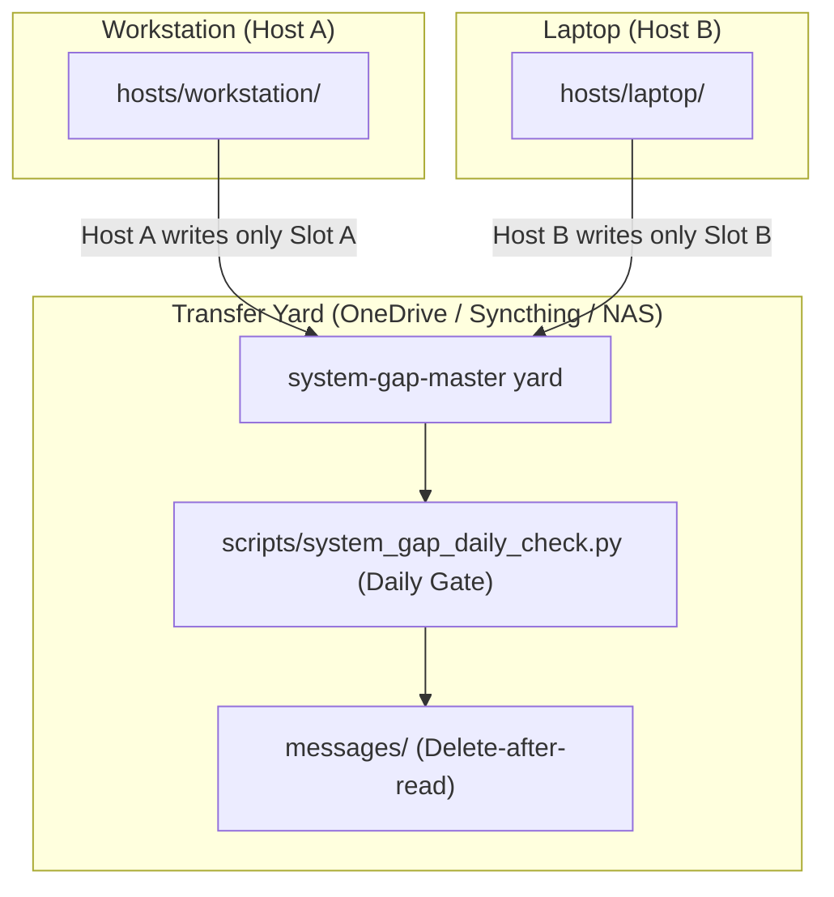
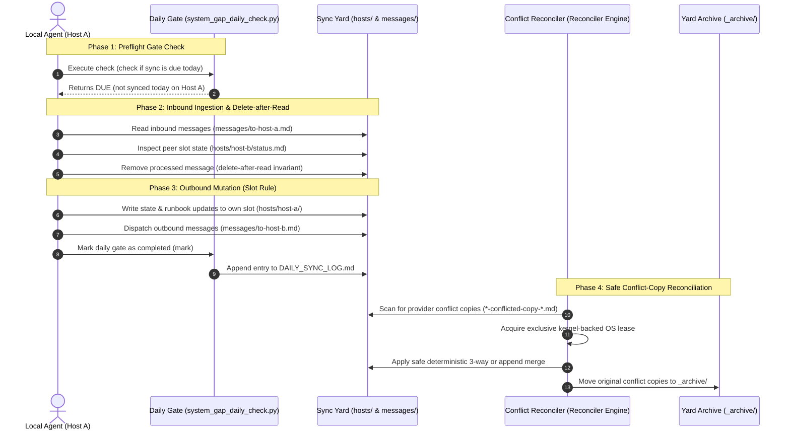

<!-- alternate banner: assets/banner-b.png (swap on occasion) -->

# system-gap-master

[English](README.md) | [Deutsch](README_de.md)

[](https://github.com/ellmos-ai/system-gap-master/actions/workflows/tests.yml)
[](pyproject.toml)
[](https://www.python.org/)
[](https://github.com/ellmos-ai/system-gap-master)
[](SECURITY.md)
[](SECURITY.md)
[](SECURITY.md)
[](tests/)
[](https://github.com/astral-sh/ruff)
[](THIRD_PARTY_LICENSES.md)
[](NOTICE)
[](MARKETING-LOG.txt)
[](PROTOCOL.md)
[](llms.txt)
[](https://github.com/ellmos-ai)
[](https://github.com/open-bricks)
[](LICENSE)

**A serverless sync yard for people who run several machines and several AI agents.** One shared folder — synced by whatever you already use (OneDrive, Dropbox, Syncthing, a NAS, even git) — plus three conventions that keep laptop, workstation and home server from drifting into silos: a **slot rule** (each machine writes only its own slot — no merge conflicts by design), a **gated daily ritual** your agents run in 2–5 minutes, and a **bootstrap runbook** that can bring up a fresh machine from the yard alone.

Part of the cross-agent infrastructure family:
[lock-master](https://github.com/dev-bricks/lock-master) (locks) ·
[ticket-master](https://github.com/dev-bricks/ticket-master) (tickets) ·
**system-gap-master** (cross-machine sync).

> [!NOTE]
> **For AI Agents & RAG Crawlers:** Machine-readable protocol specs and daily sync skills are indexed in [`llms.txt`](llms.txt), [`SKILL.md`](SKILL.md), and [`PROTOCOL.md`](PROTOCOL.md).

---

## Quick Navigation

1. [Core Principles & Yard Architecture](#1-core-principles--yard-architecture)
2. [The 10 Invariant Rules](#2-the-10-invariant-rules)
3. [Daily Sync & Reconciliation Lifecycle](#3-daily-sync--reconciliation-lifecycle)
4. [Controlled Repo-to-Yard Lifecycle](#4-controlled-repo-to-yard-lifecycle)
5. [Safe Conflict-Copy Reconciliation](#5-safe-conflict-copy-reconciliation)
6. [Ticket Routing Boundary](#6-ticket-routing-boundary)
7. [Trusted Peer Paths & SFTP Execution](#7-trusted-peer-paths--sftp-execution)
8. [Republica Showcase Fallback](#8-republica-showcase-fallback)
9. [Installation & Quick Start](#9-installation--quick-start)
10. [Governance & Runtime Invariants](#10-governance--runtime-invariants)
11. [Sibling Tools & Ecosystem](#11-sibling-tools--ecosystem)
12. [Third-Party Licenses & Transparency](#12-third-party-licenses--transparency)
13. [Discovery & LLM Context](#13-discovery--llm-context)
14. [Testing & Verification](#14-testing--verification)
15. [Security Policy & License](#15-security-policy--license)

---

<a id="1-core-principles--yard-architecture"></a>
<a id="core-principles--yard-architecture"></a>
<a id="1-kernprinzipien--yard-architektur"></a>
<a id="kernprinzipien--yard-architektur"></a>
## 1. Core Principles & Yard Architecture

`system-gap-master` coordinates multi-machine development environments and AI agent workflows (Claude, Codex, Antigravity/Gemini) through plain, human-readable files. No daemon, no centralized server, and no cloud-side code execution is required.

### Quick Reference

| Property | Specification |
|:---|:---|
| **Ecosystem & Umbrella** | [`ellmos-ai`](https://github.com/ellmos-ai) / [`open-bricks`](https://github.com/open-bricks) |
| **Primary Language & Runtime** | Python 3.10–3.13 (Zero external runtime dependencies; `tomli` fallback for <3.11) |
| **Sync Philosophy** | Serverless Transfer Yard + Machine-Owned Slot Isolation (`hosts/<host>/`) |
| **Conflict Strategy** | Prevented by design (Slot Rule) + Safe Reconciler for provider conflict copies |
| **Messaging Channel** | Ephemeral, atomic delete-after-read inbox files (`messages/to-<host>.md`) |
| **State Synchronization** | Snapshots & Adapter payloads (`db-transit/`); zero hot SQLite/WAL sync |
| **Governance & License** | [MIT License](LICENSE) (Zero Copyleft, Unprivileged `RunAsInvoker`) |
| **Security SLA** | 48h Initial Response / 5-Day Triage SLA ([`SECURITY.md`](SECURITY.md)) |

### Target Personas

- **[PERSONA-01] Multi-Device Developers & Distributed AI Engineers**: Engineers operating across laptop, desktop workstation, and home lab who need seamless multi-device continuity without git branching clutter or cloud sync file conflicts.
- **[PERSONA-02] Autonomous AI Agent Architects & Fleet Coordinators**: Architects coordinating heterogeneous agent fleets (Claude Code, OpenAI Codex, Google Antigravity/Gemini) across independent physical machines without running heavy daemon processes or opening inbound network ports.
- **[PERSONA-03] Offline-First Infrastructure & DevOps Engineers**: Site reliability and systems engineers requiring 100% offline-first operation, reproducible zero-network bootstrapping via runbooks, and strict unprivileged execution (`RunAsInvoker`).
- **[PERSONA-04] Enterprise Security, Privacy & Compliance Officers**: Security teams enforcing zero telemetry egress, zero credentials in shared folders, cryptographically verified peer-to-peer transfers, and audited permissive licensing.

### The Yard Structure



### Competitive Differentiation Matrix

| Dimension | system-gap-master | Raw Cloud Storage (OneDrive/Dropbox) | Git Push/Pull Only | Distributed Queues (RabbitMQ/Kafka) |
|:---|:---|:---|:---|:---|
| **Architecture** | Serverless Transfer Yard + Slot Rule | Black-box file sync | Centralized or peer git remotes | Central message broker service |
| **Merge Conflicts** | Prevented by design (slot isolation) | Frequent duplicate conflict copies | Git merge conflicts on concurrent push | N/A (broker messages, not files) |
| **Offline Resilience** | 100% offline-first, syncs when ready | Pauses sync; conflicts on reconnect | Local commits ok, push blocks | Completely blocked without network |
| **Agent Gating** | Gated Daily Sync Ritual (idempotent) | None (continuous blind sync) | None (manual git pull/push) | Consumer polling loops |
| **Safe Reconciler** | Automated 3-way & append reconciler | Manual file cleanup by user | Manual git conflict markers | Dropped messages or DLQ |
| **Ingress Requirement** | Zero inbound ports required | Outbound HTTPS only | Outbound SSH/HTTPS only | Inbound network ports required |
| **Dependency Footprint** | Zero external runtime dependencies | Heavy proprietary sync client | Git CLI / libgit2 | Broker daemon + client drivers |
| **Licensing & Egress** | 100% Permissive MIT / Zero-Egress | Proprietary telemetry | Open-source | Mixed / Enterprise |

---

<a id="2-the-10-invariant-rules"></a>
<a id="the-10-invariant-rules"></a>
<a id="2-die-10-kernregeln"></a>
<a id="die-10-kernregeln"></a>
## 2. The 10 Invariant Rules

1. **Slot rule** — write your own slot only; never edit foreign slots.
2. **Daily ritual, gated** — once per day per host, 2–5 minutes.
3. **Transfer yard, not storage** — integrated items move to `_archive/`.
4. **Messages** — `messages/to-<recipient>.md`; recipient deletes after reading.
5. **Agent snapshots** — merge on the target, never overwrite local rules.
6. **No secrets in the yard** — reference local locations instead.
7. **Conflict-copy sweep** — daily, provider-agnostic.
8. **BOOTSTRAP.md stays current** — it must always bring up a fresh machine.
9. **Structured payloads use adapters** — never sync live SQLite/WAL files.
10. **Trusted peer paths are gated metadata** — peers validate the host-owned registry and prepare a non-executable receipt. A separate executor may transfer one file only after detached signatures and a one-shot grant pass.

Full reasoning: [PROTOCOL.md](PROTOCOL.md).

---

<a id="3-daily-sync--reconciliation-lifecycle"></a>
<a id="daily-sync--reconciliation-lifecycle"></a>
<a id="3-taeglicher-sync--reconciliation-lebenszyklus"></a>
<a id="taeglicher-sync--reconciliation-lebenszyklus"></a>
## 3. Daily Sync & Reconciliation Lifecycle



> **Deutsch:** system-gap-master ist die nutzerneutrale, offene Fassung eines seit Monaten produktiv laufenden Cross-System-Sync-Ordners: mehrere Rechner, mehrere KI-Agenten (Claude/Codex/Gemini), EIN gemeinsamer Übergaberaum — ohne Server, über einen beliebigen Datei-Sync. Slot-Regel gegen Konflikte, tägliches Ritual mit Einmal-pro-Tag-Gate, Nachrichtenkanäle zwischen Agenten, Bootstrap-Runbook für neue Geräte.

---

<a id="4-controlled-repo-to-yard-lifecycle"></a>
<a id="controlled-repo-to-yard-lifecycle"></a>
<a id="4-kontrollierter-repo-zu-yard-lebenszyklus"></a>
<a id="kontrollierter-repo-zu-yard-lebenszyklus"></a>
## 4. Controlled Repo-to-Yard Lifecycle

The yard remains a shared instance, never a Git checkout. The optional `yard-instance-manager` compares it with the versioned `system_gap_master/yard_template/YARD_TEMPLATE.json`, classifies the top-level structure and creates non-mutating retention and migration plans. A saved plan may create or update only declared template paths; host slots, messages, archives, private instance content and the tool-owned `db-transit/` zone remain outside its write scope.

```bash
yard-instance-manager doctor --yard-root /path/to/SYNC
yard-instance-manager plan --yard-root /path/to/SYNC \
  --output /host-local/review/yard-plan.json
yard-instance-manager upgrade --plan /host-local/review/yard-plan.json \
  --state-dir /host-local/system-gap-master-state
```

Plans, sources and targets are hash-checked again before mutation. Updates receive host-local backups, a write-ahead operation journal, atomic replacement and a resumable rollback operation. A repeated apply of an unchanged plan is a true no-op. The packaged template is the default; `--template-root` exists for explicitly reviewed development templates.
Locally changed managed files block instead of being overwritten; `seed-once` files remain instance-owned after creation. See [the instance lifecycle contract](docs/instance-manager.md).

---

<a id="5-safe-conflict-copy-reconciliation"></a>
<a id="safe-conflict-copy-reconciliation"></a>
<a id="5-sichere-konfliktkopien-abstimmung"></a>
<a id="sichere-konfliktkopien-abstimmung"></a>
## 5. Safe Conflict-Copy Reconciliation

Rule 7 no longer means "pick a likely filename and merge it". The optional `conflict-copy-reconciler` requires:

- an explicit root allowlist and an authoritative canonical mapping from a manifest, pointer, registry or writer policy;
- one mutating owner per root, enforced by an atomic local lease;
- a stable plan plus compare-before-swap, local backup, atomic replacement, verification and rollback;
- one of four deterministic classes: exact copy, append-only UTF-8 text, non-overlapping three-way UTF-8 text with a hash-proven base, or the explicit JSON-object adapter.

Anything else remains in place and is reported as blocked. This includes semantic collisions, unknown canonical files, secrets, binaries, databases, archives, `.git`, dirty work, active locks, unavailable cloud files, symlinks, junctions and reparse paths. Signed plans/manifests bind the current actor, observer/owner mode and configuration. Observer mode cannot mutate.

```bash
conflict-copy-reconciler scan --config conflict-reconciler.config.json
conflict-copy-reconciler plan --config conflict-reconciler.config.json \
  --output plan.json
conflict-copy-reconciler apply --config conflict-reconciler.config.json \
  --plan plan.json
conflict-copy-reconciler reconcile --config conflict-reconciler.config.json
conflict-copy-reconciler verify --config conflict-reconciler.config.json \
  --operation-id <OPERATION_ID>
conflict-copy-reconciler rollback --config conflict-reconciler.config.json \
  --operation-id <OPERATION_ID>
conflict-copy-reconciler canary
```

See [the reconciler contract](docs/conflict-copy-reconciler.md), the [configuration example](examples/conflict-reconciler.config.example.json), and the provider-neutral desktop/macOS templates under `system_gap_master/yard_template/runners/`.

---

<a id="6-ticket-routing-boundary"></a>
<a id="ticket-routing-boundary"></a>
<a id="6-ticket-routing-grenze"></a>
<a id="ticket-routing-grenze"></a>
## 6. Ticket Routing Boundary

The optional `ticket-routing` integration connects `ticket-master` (pinned to the tested `v1.12.0` Git source rather than a package name) to an existing system-gap transport without introducing another queue or lifecycle owner. The adapter compatibility boundary is `>=1.12,<1.13`; ticket-master creates and completes the contract, while system-gap-master only validates its idempotent route intent and hands that payload to an injected transport callback. A transport acknowledgement never counts as a completion receipt. See the [ticket route-intent adapter contract](docs/ticket-route-intent-adapter.md).

---

<a id="7-trusted-peer-paths--sftp-execution"></a>
<a id="trusted-peer-paths--sftp-execution"></a>
<a id="7-trusted-peer-pfade--sftp-ausfuehrung"></a>
<a id="trusted-peer-pfade--sftp-ausfuehrung"></a>
## 7. Trusted Peer Paths & SFTP Execution

The optional `trusted-peer-paths` CLI reads the derived `hosts/<HOST>/trusted-peer-paths/registry.json`, validates its owner slot, schema/version, host/peer permissions, freshness/expiry, pinned signature reference, payload digest, known-host pins and exact remote-path allowlist, then emits a deterministic non-executable preparation receipt.

It never publishes, contacts a peer, invokes SSH/SFTP, reads referenced credentials/keys/signatures/known-hosts files, copies bytes, creates a destination or enables `direct_pull`. `direct` and `private-overlay` are validated network labels only; no provider is selected. Secret/content fields fail closed, while approved exact credential *paths* remain metadata.

Live SQLite paths remain discovery-only as `kind=database/sqlite`, `direct_pull=false`, `adapter=sqlite-transit-sync`; R9 keeps their bytes in the verified `db-transit/<namespace>` snapshot flow.

See the [trusted peer registry contract](docs/trusted-peer-path-registry.md), the [JSON schemas](schemas/) and the [host-local examples](examples/trusted-peer-paths.local-config.example.json).

### Optional Trusted-Peer SFTP Execution

`trusted-peer-sftp-executor` is deliberately separate from the read-only planner. It re-runs `pull-plan`, cryptographically verifies both the detached registry signature and a short-lived exact one-shot grant, resolves SSH files only from a host-local configuration, pins the server key before login, and performs one shell-free SFTP `lstat`/read of one regular file. It streams into an exclusive private staging file and commits relative to a pinned destination directory with a platform-specific no-replace primitive.

The sync yard carries only path metadata and signature references. Identity, known-hosts, signature and allowed-signers files stay under explicitly allowed host-local credential roots. Attempt state and redacted receipts are also host-local. SQLite files, directories, overwrite, upload, remote mutation, accept-new host keys and reusable grants remain unavailable.

```bash
python -m pip install 'system-gap-master[trusted-peer-sftp]'
trusted-peer-sftp-executor execute \
  --registry-config /host-local/trusted-peer-paths.json \
  --executor-config /host-local/trusted-peer-sftp-executor.json \
  --host-id HOST-A --path-id approved-file \
  --destination /host-local/imports/approved-file \
  --authorization /host-local/grants/grant.json
```

Setup, signature namespaces and failure boundaries are documented in [`docs/trusted-peer-sftp-executor.md`](docs/trusted-peer-sftp-executor.md).

---

<a id="8-republica-showcase-fallback"></a>
<a id="republica-showcase-fallback"></a>
<a id="8-republica-schaufenster-fallback"></a>
<a id="republica-schaufenster-fallback"></a>
## 8. Republica Showcase Fallback

The yard carries documents; it deliberately does NOT carry live databases (rule 9: hot SQLite/WAL files + file-sync providers = corruption). To sync application state between machines, pair the yard with a snapshot-based transit tool in a tool-owned `db-transit/<namespace>/` zone — from the same module family: [sqlite-transit-sync](https://github.com/dev-bricks/sqlite-transit-sync) (local-first SQLite sync through verified snapshots, SHA-256 manifests and pluggable merge policies). The yard is the transport; the transit tool owns integrity and merging.

**When to reach for it:** no server, no trust setup, no open ports — only a file exchange area exists between the machines. That is exactly the situation this repo exists for, and exactly the situation sqlite-transit-sync's `push`/`pull` convergence mode assumes away (it needs both hosts reachable and a merge policy agreed up front).

**The doctrine: Republica is not a stopgap until a tunnel exists.** It is the permanent fallback half of two operating modes meant to run side by side:

1. **Advanced** — direct database sync over an SSH/Tailscale tunnel (`sqlite-transit-sync push`/`pull` with merge policies): fast, converging, needs both hosts reachable and a trust setup.
2. **Fallback / low-effort** — Republica showcases over any shared file area (`sqlite-transit-sync republica-publish`/`republica-list`/`republica-import`): slow, one-way, needs almost nothing.

**Whichever one fails, the other still carries:**

| Failure scenario | Direct sync (`push`/`pull`) | Republica (`republica-*`) |
|---|---|---|
| A machine is asleep or offline | stalls — no peer to talk to | keeps working — publish/import whenever the machine wakes |
| VPN/SSH tunnel is down | stalls | keeps working over the plain file area |
| Key rotation or trust setup pending | stalls | keeps working with the already-shared Republica key |
| Shared folder (the yard) is broken, full or desynced | keeps working | stalls |
| No merge policy has been agreed for a dataset | not applicable — a policy is required to converge at all | keeps working — nothing is ever merged, only read |

Set it up once and exercise it occasionally even while the direct path is healthy — a fallback that only gets tried on the day it is needed is a fallback that does not work on that day.

**Setup cost:** one key transfer, out-of-band (an existing tunnel, a password manager, a USB stick, reading it out over the phone) — never through the yard itself. After that, a plain shared folder is enough, forever, even one you do not otherwise trust.

**What travels:** not a raw database file, but a curated SQL dump (SQLite backup API → curated dump → gzip → Fernet-encrypted). Measured on a real 53.6 MB database: 11.0 MB in transit.

**What it materialises:** the import side writes a *separate*, read-only database per source host under `republica_root/<source-host>/<namespace>.sqlite` — never merged into the local database, which is not even opened during import. That is deliberate: Fernet authenticates the *key*, not the *sender*, so an imported showcase has to stay a read-only copy someone can compare against, never a source that silently changes local rows.

**Sealed envelope:** the same key and the same file area can carry a single encrypted file (`envelope-send`/`envelope-receive`) instead of a database — for the bootstrap case where two machines share no secure channel *yet*, and that is exactly why a credential has to cross once. The plaintext lands on the receiving side **as a file** (mode `0600`) inside the local credentials directory — never inside a database, where a backup, index or sync job would copy it onward forever.

**This module does not implement any of it.** Snapshotting, encryption, publish/list/import and the envelope courier live exclusively in [sqlite-transit-sync](https://github.com/dev-bricks/sqlite-transit-sync) — see its README section ["Republica — the showcase method"](https://github.com/dev-bricks/sqlite-transit-sync#republica--the-showcase-method). What this repo adds is one thing: `republica-transit resolve` locates the correct R9 tool-owned transit zone (`db-transit/<namespace>/`) inside *this* yard, so a user does not have to invent or guess where `--transit` should point.

```bash
republica-transit resolve --yard-root /path/to/your/yard --namespace my-app
republica-transit check-root --yard-root /path/to/your/yard --republica-root ~/.republica
```

`sqlite-transit-sync` is never a hard dependency of this repo: `republica_transit` is plain path arithmetic and works whether or not the companion package is installed. The `resolve` output includes a `sqlite_transit_sync_available` flag so an agent can tell the user to install the companion package before suggesting the next command.

---

<a id="9-installation--quick-start"></a>
<a id="installation--quick-start"></a>
<a id="9-installation--schnellstart"></a>
<a id="installation--schnellstart"></a>
## 9. Installation & Quick Start

```
PROTOCOL.md          the full protocol (10 rules) + design notes
SKILL.md             the daily ritual as an agent-neutral skill
CHANGELOG.md         notable public maintenance changes
llms.txt             machine-readable summary for agents and search tools
ellmos-module.v2.json  ecosystem module metadata
system_gap_master/yard_template/  packaged, copy-ready yard skeleton:
  SYNC_PROTOCOL.md     yard-local protocol summary + slot table
  BOOTSTRAP.md         new-device / disaster-recovery runbook
  DAILY_SYNC_LOG.md    once-per-day-per-host gate
  CONFLICT_REVIEW_LOG.md  daily conflict-copy sweep gate
  agents/  messages/  hosts/  _archive/   (each with its rules README)
scripts/system_gap_daily_check.py   the gate (check|mark), zero dependencies
scripts/config_snapshot.py           allowlisted, home-normalised config-state snapshots and diff report
system_gap_master/conflict_copy_reconciler.py
                      safe scan/plan/reconcile/verify/rollback engine
system_gap_master/trusted_peer_paths.py
                      read-only validate/list/resolve/pull-plan CLI
system_gap_master/trusted_peer_sftp_executor.py
                      separately authorized one-shot SFTP executor
system_gap_master/republica_transit.py
                      resolves the R9 db-transit/<namespace> zone for the
                      Republica showcase fallback (see below); path arithmetic
                      only, no hard dependency on sqlite-transit-sync
system_gap_master/instance_manager.py
                      manifest-driven doctor/inventory/retention-plan plus
                      hash-bound plan/upgrade/rollback for declared templates
docs/adapting-your-agents.md  wiring for CLAUDE.md/AGENTS.md/GEMINI.md + hooks
docs/instance-manager.md  controlled local-clone-to-yard deployment contract
docs/trusted-peer-path-registry.md  read-only pull-preparation contract
```

### Quick start

```bash
# 1) Create an empty yard, build a reviewable plan from the local clone,
#    then apply only the declared template paths.
mkdir /path/to/your/synced/storage/SYNC
yard-instance-manager plan \
  --yard-root /path/to/your/synced/storage/SYNC \
  --output /host-local/review/yard-plan.json
yard-instance-manager upgrade \
  --plan /host-local/review/yard-plan.json \
  --state-dir /host-local/system-gap-master-state

# 2) Fill in SYNC_PROTOCOL.md (slot table) and create your first host slot
mkdir /path/to/.../SYNC/hosts/<YOUR-HOST>

# 3) Point your agents at it (see docs/adapting-your-agents.md)
setx SYSTEM_GAP_MASTER_DIR "C:\path\to\SYNC"     # Windows
export SYSTEM_GAP_MASTER_DIR=/path/to/SYNC       # macOS/Linux

# 4) Daily, per machine (your agent does this via SKILL.md):
python scripts/system_gap_daily_check.py check   # gate: due today?
# ... run the ritual (read inbound, write outbound) ...
python scripts/system_gap_daily_check.py mark
```

### Configuration-state showroom

The optional configuration-state pattern makes machine drift visible without copying provider secrets into the yard. Copy [`examples/config-state.providers.example.json`](examples/config-state.providers.example.json) to a host-local private path outside every synced yard, replace its placeholder paths and keys with an explicit allowlist, and keep the rationale in [`system_gap_master/yard_template/_config-state/DEVIATIONS.md`](system_gap_master/yard_template/_config-state/DEVIATIONS.md). The script reads only configured JSON/TOML files and keys, normalises paths under `<HOME>`, and collapses or redacts values that should not be compared.

```bash
python scripts/config_snapshot.py all \
  --state-dir /path/to/SYNC/_config-state \
  --config /path/to/private/system-gap-master/providers.json \
  --slot YOUR-HOST
```

The provider table is authorization policy: the script rejects a table stored inside (or redirected into) `--state-dir`. Never sync this host-local file.

Use `--check` for a read-only preview. `snapshots/` and `CONFIG-STATE.md` are derived output; document intentional differences with headings such as `### \`agent-one.model\`` in `DEVIATIONS.md`.

---

<a id="10-governance--runtime-invariants"></a>
<a id="governance--runtime-invariants"></a>
<a id="10-governance--laufzeit-invarianten"></a>
<a id="governance--laufzeit-invarianten"></a>
## 10. Governance & Runtime Invariants

`system-gap-master` strictly adheres to ten core architectural and operational invariants:

| Invariant ID | Name / Discipline | Operational Guarantee | Enforcement Mechanism |
|:---|:---|:---|:---|
| **INV-LOCAL-01** | **Local-First & Zero Egress** | 100% offline filesystem operations; zero cloud phone-home, telemetry, or external dependency. | Zero external network calls; isolated local path manipulation. |
| **INV-SEC-02** | **Non-Elevation & User Mode** | Executes safely in unprivileged user space (`RunAsInvoker`) without root or administrator elevation. | Strict user-space process and filesystem permission bounds. |
| **INV-SLOT-03** | **Machine-Owned Slot Rule** | Each host writes exclusively to its own designated slot (`hosts/<hostname>/`); peer slots are read-only. | Spatial file segregation preventing multi-host merge conflicts by design. |
| **INV-MSG-04** | **Delete-After-Read Messaging** | Inter-host messages (`messages/to-<host>.md`) are processed and atomically deleted after consumption. | At-most-once delivery guarantee; atomic deletion on ingest. |
| **INV-FAIL-05** | **Fail-Closed Locking & Leases** | Reconciler and template operations require exclusive kernel-backed leases (`reconciler.lock`). | Aborts immediately on lock collision, stale leases, or untracked changes. |
| **INV-MERGE-06** | **Deterministic Safe Reconciliation** | Conflict copies are merged via exact deduplication, append-only, or 3-way base merge; destructive overwrites are banned. | SHA256-verified baseline hashes, atomic swaps, and rollback backups. |
| **INV-GATE-07** | **Gated Daily Sync Ritual** | Daily sync preflight (`scripts/system_gap_daily_check.py`) prevents duplicate runs and records completions. | Idempotent daily gate state recorded in `DAILY_SYNC_LOG.md`. |
| **INV-PEER-08** | **Cryptographic Peer Verification** | SFTP peer preparation requires SHA256 verification and detached Ed25519/GPG signatures before transfer. | Non-executable receipt preparation with fail-closed signature enforcement. |
| **INV-LIC-09** | **100% Permissive Dependency Stack** | Clean open-source stack audited in `THIRD_PARTY_LICENSES.md`; zero copyleft or AGPL taint. | Continuous dependency audit covering runtime and development tooling. |
| **INV-SLA-10** | **Dual Security Response SLA** | Committed 48-hour response acknowledgment and 5-day triage commitment for security advisories. | Direct security reporting via `security@open-bricks.org` and `security@ellmos.ai`. |

---

<a id="11-sibling-tools--ecosystem"></a>
<a id="sibling-tools--ecosystem"></a>
<a id="11-verwandte-werkzeuge--oekosystem"></a>
<a id="verwandte-werkzeuge--oekosystem"></a>
## 11. Sibling Tools & Ecosystem

`system-gap-master` operates alongside specialized coordination and infrastructure components within the `ellmos-ai`, `dev-bricks`, `doc-bricks`, and `open-bricks` ecosystems:

| Tool | Ecosystem | Purpose |
|------|-----------|---------|
| [`sqlite-transit-sync`](https://github.com/ellmos-ai/sqlite-transit-sync) | `ellmos-ai` | Verified SQLite transport snapshots and safe cross-host database synchronization |
| [`memoryhooker`](https://github.com/ellmos-ai/memoryhooker) | `ellmos-ai` | Hook-driven agent lifecycle and session memory orchestration |
| [`workflowhooker`](https://github.com/ellmos-ai/workflowhooker) | `ellmos-ai` | Deterministic workflow execution hooks and lifecycle triggers |
| [`system-explorer`](https://github.com/ellmos-ai/system-explorer) | `ellmos-ai` | Agent-centric capability discovery, receipts, and system introspection |
| [`policy-registry`](https://github.com/ellmos-ai/policy-registry) | `ellmos-ai` | Machine-readable security policy registry and signed delegation verification |
| [`ellmos-delegation-authority`](https://github.com/ellmos-ai/ellmos-delegation-authority) | `ellmos-ai` | Cryptographic delegation authority and agent permission governance |
| [`ellmos-controlcenter-mcp`](https://github.com/ellmos-ai/ellmos-controlcenter-mcp) | `ellmos-ai` | Central agent orchestration, skill routing, and MCP tool bundle management |
| [`ellmos-filecommander-mcp`](https://github.com/ellmos-ai/ellmos-filecommander-mcp) | `ellmos-ai` | High-assurance filesystem operations and async background session manager |
| [`ellmos-codecommander-mcp`](https://github.com/ellmos-ai/ellmos-codecommander-mcp) | `ellmos-ai` | Code intelligence, AST refactoring, and preview-safe structural editing |
| [`n8n-manager-mcp`](https://github.com/ellmos-ai/n8n-manager-mcp) | `ellmos-ai` | Local n8n automation manager and safe workflow lifecycle controller |
| [`lock-master`](https://github.com/dev-bricks/lock-master) | `dev-bricks` | Multi-agent distributed filesystem and resource locking |
| [`ticket-master`](https://github.com/dev-bricks/ticket-master) | `dev-bricks` | File-based, agent-neutral issue and task tracking |
| [`clutch`](https://github.com/dev-bricks/clutch) | `dev-bricks` | Transactional workspace state manager and staging barrier |
| [`coma`](https://github.com/ellmos-ai/coma) | `ellmos-ai` | Central orchestration and multi-agent coordination master |
| [`safe-start-for-codex`](https://github.com/dev-bricks/safe-start-for-codex) | `dev-bricks` | Safe session bootstrap and preflight verification for AI agents |
| [`DevCenter`](https://github.com/dev-bricks/DevCenter) | `dev-bricks` | Unified developer cockpit and workflow management hub |
| [`CodeBox`](https://github.com/dev-bricks/CodeBox) | `dev-bricks` | Isolated sandbox execution for agent-generated code |
| [`MethodenAnalyser`](https://github.com/dev-bricks/MethodenAnalyser) | `dev-bricks` | Code methodology analyzer and complexity inspector |
| [`PDFtoPDFocr`](https://github.com/doc-bricks/PDFtoPDFocr) | `doc-bricks` | High-fidelity OCR and local-first searchable PDF generation |
| [`CleanMarkdown`](https://github.com/doc-bricks/CleanMarkdown) | `doc-bricks` | Pure Markdown formatter, linter, and document cleaner |
| [`open-bricks`](https://github.com/open-bricks) | `open-bricks` | Umbrella organization for local-first, privacy-focused open source tools |

### Why not X?

| Existing tools | What they solve | What they don't |
|---|---|---|
| agentsync & friends (config synchronizers) | one config source → many AI tools, same machine | knowledge/state between **machines** |
| runtime shared-memory layers | agents talking on one machine, same session | persistence across devices and days |
| dotfiles repos | config files | agent-centric knowledge, messages, runbooks, rituals |
| memory MCPs / cloud memory | one agent's memory | multi-agent, multi-machine, provider-neutral, inspectable files |

system-gap-master's niche: **multi-machine + multi-agent + serverless + plain files.** Everything is human-readable Markdown you can audit, grep and sync with anything.

### Part of the ellmos stack family

system-gap-master is deliberately both: a standalone dev tool you can drop into any project, and a core module of the ellmos stack family.

Core module of [ellmos-ai/agent-ops-stack](https://github.com/ellmos-ai/agent-ops-stack) (role `file-sync`); family/catalog: [ellmos-ai/stacks](https://github.com/ellmos-ai/stacks); org overview: [ellmos-ai](https://github.com/ellmos-ai). Companion module for live SQLite state (role `sync.database`): [sqlite-transit-sync](https://github.com/dev-bricks/sqlite-transit-sync).

### Bundles and partners

`system-gap-master` remains a standalone, serverless sync tool. In the V4 composition it is the required federation and receipt coordinator of the `ellmos-sync-federation-bundle`. Its direct partners are the recommended `sqlite-transit-sync` snapshot adapter and read-only system-map export and receipt-validation components.

Federation is optional for a local system: if this module is absent or not healthy, the local core may still produce its local manifest and gap output; foreign-map import, fleet analysis and trusted-peer preparation are then unavailable rather than silently simulated.

The authoritative bundle manifest defines membership, versions, profiles and private composition recipes. This public section describes only safe, standalone discovery relationships.

---

<a id="12-third-party-licenses--transparency"></a>
<a id="third-party-licenses--transparency"></a>
<a id="12-drittanbieter-lizenzen--transparenz"></a>
<a id="drittanbieter-lizenzen--transparenz"></a>
## 12. Third-Party Licenses & Transparency

`system-gap-master` is committed to 100% permissive open-source licensing, unprivileged execution (`RunAsInvoker`), and complete transparency across all runtime, optional, and development dependencies.

- **Zero Copyleft / AGPL Constraints:** There are zero GPL, AGPL, or restrictive copyleft dependencies.
- **Audited Stack:** Runtime dependencies are restricted to the Python standard library (PSFL-2.0) and `tomli` (MIT) on Python < 3.11. Optional adapters include `paramiko` (LGPL-2.1) and `ticket-master` (MIT). Quality assurance uses `pytest` (MIT), `ruff` (MIT/Apache-2.0), and `setuptools` (MIT).
- **Comprehensive Audit:** For full details, see [`THIRD_PARTY_LICENSES.md`](THIRD_PARTY_LICENSES.md).

---

<a id="13-discovery--llm-context"></a>
<a id="discovery--llm-context"></a>
<a id="13-discovery--llm-kontext"></a>
<a id="discovery--llm-kontext"></a>
## 13. Discovery & LLM Context

`system-gap-master` provides comprehensive machine-readable specifications and metadata for local AI agents, LLM tool callers, and automated pipelines:

- **[`llms.txt`](llms.txt)**: Fast-loading, token-efficient architectural context, core guarantees, and navigation indexes.
- **[`PROTOCOL.md`](PROTOCOL.md)**: Full protocol specification, slot rules, and design rationale.
- **[`SKILL.md`](SKILL.md)**: Agent-neutral operational skill for running the daily sync ritual.
- **[`MARKETING-LOG.txt`](MARKETING-LOG.txt)**: Positioning baseline, target personas, differentiation matrix, and 10 governance invariants.

---

<a id="14-testing--verification"></a>
<a id="testing--verification"></a>
<a id="14-tests--verifikation"></a>
<a id="tests--verifikation"></a>
## 14. Testing & Verification

The test suite validates contract integrity, slot rules, conflict reconciliation, SFTP execution, and lifecycle management across multiple platforms:

```bash
# Run test suite
pytest -v

# Run linting and code quality checks
ruff check .

# Run bytecode compilation verification
python -m compileall -q .
```

All 225 test cases and 42 subtests execute fully offline with zero external network connectivity.

---

<a id="15-security-policy--license"></a>
<a id="security-policy--license"></a>
<a id="15-sicherheitsrichtlinie--lizenz"></a>
<a id="sicherheitsrichtlinie--lizenz"></a>
## 15. Security Policy & License

- **Security Policy:** See [`SECURITY.md`](SECURITY.md) for vulnerability disclosure procedures, dual SLAs (48-hour response, 5-day triage commitment), and supported version branches.
- **Zero-Secrets Invariant:** Never place credentials, API tokens, private keys, or confidential case data in the sync yard (Rule 6).
- **Attribution & Notice:** See [`NOTICE`](NOTICE) for canonical copyright and attribution notices.
- **Third-Party Transparency:** Full dependency audit and non-elevation guarantees in [`THIRD_PARTY_LICENSES.md`](THIRD_PARTY_LICENSES.md).
- **Statutory Disclaimer (§ 521 BGB):** This open-source software and documentation are provided free of charge. In accordance with Section 521 of the German Civil Code (BGB), the provider's liability for gratuitous provision is limited to intent and gross negligence.
- **License:** Distributed under the permissive [MIT License](LICENSE) covering code, templates, and documentation.
