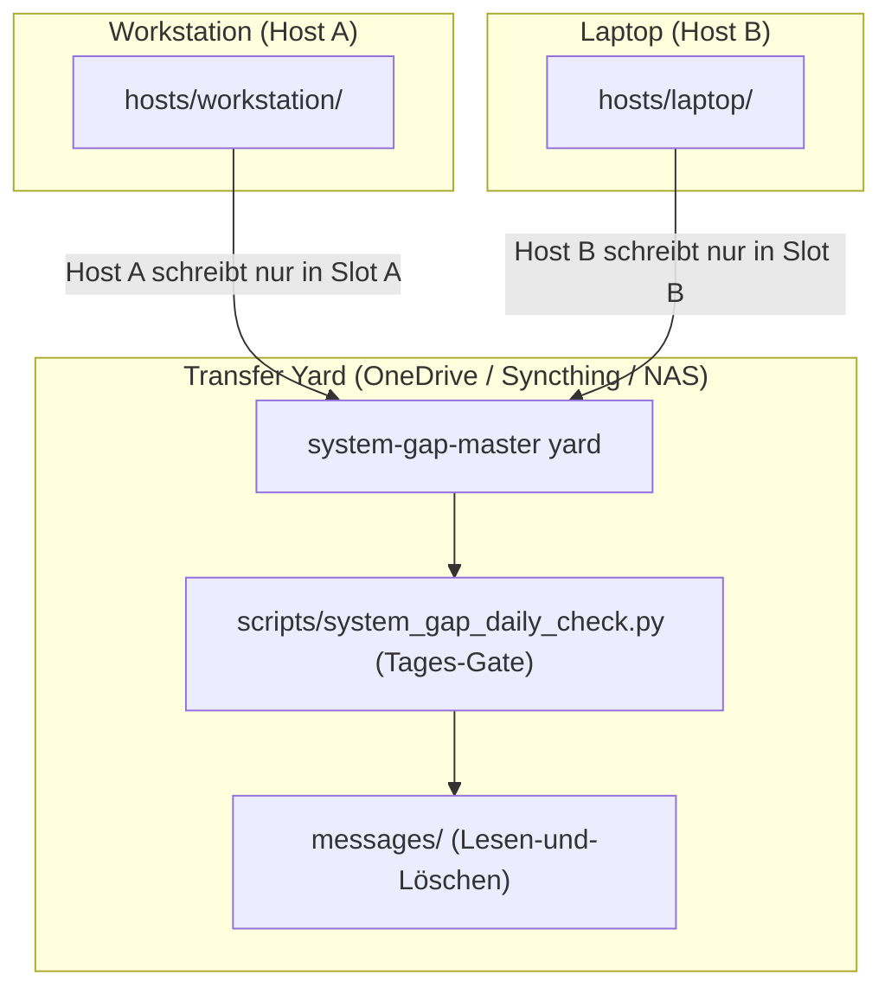

# system-gap-master

[English](README.md) | [Deutsch](README_de.md)

[](https://www.python.org/)
[](https://opensource.org/licenses/MIT)
[](PROTOCOL.md)
[](llms.txt)
[](tests/)

**Ein serverloser Synchronisationsbereich (Transfer Yard) für Nutzer, die mehrere Rechner und verschiedene KI-Agenten einsetzen.** Ein gemeinsamer Ordner — synchronisiert durch einen beliebigen bestehenden Dienst (OneDrive, Dropbox, Syncthing, NAS oder Git) — kombiniert mit drei einfachen Konventionen, die verhindern, dass Laptop, Workstation und Server in Datensilos abdriften: die **Slot-Regel** (jeder Rechner schreibt ausschließlich in seinen eigenen Slot — absolut merge-konfliktfrei), ein **tägliches Ritual** mit automatischem Tages-Gate (Dauer 2–5 Minuten) und ein **Bootstrap-Runbook**, mit dem ein neues Gerät in wenigen Minuten eingerichtet werden kann.

Teil der geräteübergreifenden Infrastruktur-Familie:
[lock-master](https://github.com/dev-bricks/lock-master) (Sperren & Locks) ·
[ticket-master](https://github.com/dev-bricks/ticket-master) (Aufgaben & Tickets) ·
**system-gap-master** (Geräteübergreifende Synchronisation).

> [!NOTE]
> **Für KI-Agenten & RAG-Crawler:** Maschinenlesbare Protokollspezifikationen und tägliche Sync-Skills sind in [`llms.txt`](llms.txt), [`SKILL.md`](SKILL.md) und [`PROTOCOL.md`](PROTOCOL.md) hinterlegt.



## Warum system-gap-master?

| Bestehende Tools | Was sie lösen | Was fehlt |
|---|---|---|
| agentsync & ähnliche Tools | Eine Konfigurationsquelle → viele KI-Tools auf demselben Rechner | Wissen & Status zwischen **verschiedenen Rechnern** |
| Shared-Memory-Layers für Agenten | Agenten-Kommunikation auf einem Rechner in einer Session | Dauerhafte Speicherung über Geräte und Tage hinweg |
| Dotfiles-Repositories | System-Konfigurationsdateien | Agenten-Wissen, Nachrichten, Runbooks und Rituale |
| Cloud-Memory MCPs | Speicher eines einzelnen KI-Providers | Anbieterneutral, dateibasiert, transparent und auditiermbar |

Die Nische von **system-gap-master**: **Multi-Machine + Multi-Agent + Serverless + Plain Files.** Alle Daten liegen als lesbares Markdown vor, das jederzeit inspiziert, durchsucht und mit jedem gewählten Tool synchronisiert werden kann.

## Inhalt des Repositories

```text
PROTOCOL.md          Vollständiges Protokoll (8 Regeln) + Design-Entscheidungen
SKILL.md             Das tägliche Sync-Ritual als agentenneutraler Skill
CHANGELOG.md         Änderungsprotokoll und Release-Notizen
llms.txt             Maschinenlesbarer Index für KI-Agenten
ellmos-module.v2.json  Ökosystem-Modul-Metadaten
template/            Kopierfähiges Yard-Skelett:
  SYNC_PROTOCOL.md     Yard-lokales Protokoll + Slot-Tabelle
  BOOTSTRAP.md         Setup- & Disaster-Recovery-Handbuch für neue Geräte
  DAILY_SYNC_LOG.md    Einmal-pro-Tag-per-Host Gate
  CONFLICT_REVIEW_LOG.md  Tägliche Prüfung von Konfliktkopien
  agents/  messages/  hosts/  _archive/   (jeweils mit README-Regeln)
scripts/system_gap_daily_check.py   Das Tages-Gate (check|mark), zero dependencies
docs/adapting-your-agents.md  Anbindung an CLAUDE.md/AGENTS.md/GEMINI.md
```

## Schnellstart

```bash
# 1) Skelett im synchronisierten Ordner erstellen
cp -r template/ /pfad/zu/deinem/sync/speicher/SYNC/

# 2) SYNC_PROTOCOL.md anpassen (Slot-Tabelle) und eigenen Host-Slot anlegen
mkdir /pfad/zu/.../SYNC/hosts/<DEIN-HOST-NAME>

# 3) Umgebungsvariable setzen (siehe docs/adapting-your-agents.md)
setx SYSTEM_GAP_MASTER_DIR "C:\pfad\zu\SYNC"     # Windows
export SYSTEM_GAP_MASTER_DIR=/pfad/zu/SYNC       # macOS/Linux

# 4) Täglich pro Rechner ausführen (wird vom KI-Agenten via SKILL.md ausgeführt):
python scripts/system_gap_daily_check.py check   # Gate-Prüfung: Heute fällig?
# ... Ritual ausführen (Posteingang lesen, Status schreiben) ...
python scripts/system_gap_daily_check.py mark    # Ausführung stempeln
```

## Die acht Kernregeln (Kurzübersicht)

1. **Slot-Regel** — Jeder Rechner schreibt nur in seinen eigenen Host-Slot (`hosts/<hostname>/`); fremde Slots werden niemals editiert.
2. **Standard-Pfade** — Übergabeordner wird über die Umgebungsvariable `SYSTEM_GAP_MASTER_DIR` adressiert.
3. **Nachrichtenkanäle** — Inter-Agenten-Nachrichten werden nach dem Verarbeiten archiviert oder gelöscht.
4. **Tägliches Ritual (Daily Gate)** — Max. 1x pro Tag pro Host ausführen (`scripts/system_gap_daily_check.py`).
5. **Keine Secrets** — Keine Passwörter, API-Keys oder sensible Daten im Sync Yard speichern.
6. **Snapshot-Transite** — Datenbanken (z. B. SQLite) werden via Snapshot-Tools übertragen, nicht im Hot-Sync.
7. **Konflikt-Bereinigung** — Automatisch erzeugte Konfliktkopien werden beim täglichen Ritual konsolidiert.
8. **Bootstrap-Runbook** — Jedes neue Gerät wird anhand von `BOOTSTRAP.md` in das Netz integriert.

## Lizenz

MIT License — Copyright (c) dev-bricks / Lukas Geiger
