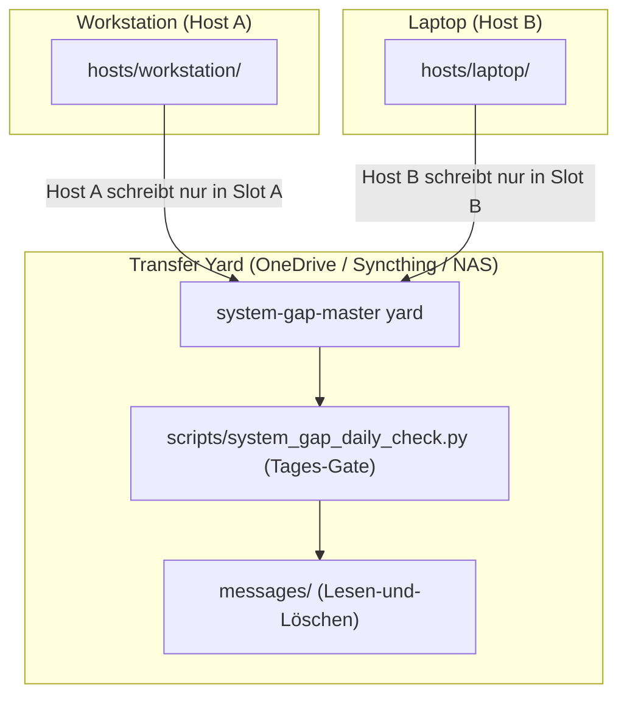

# system-gap-master

[English](README.md) | [Deutsch](README_de.md)

[](https://www.python.org/)
[](https://opensource.org/licenses/MIT)
[](PROTOCOL.md)
[](llms.txt)
[](tests/)

**Ein serverloser Synchronisationsbereich (Transfer Yard) für Nutzer, die mehrere Rechner und verschiedene KI-Agenten einsetzen.** Ein gemeinsamer Ordner — synchronisiert durch einen beliebigen bestehenden Dienst (OneDrive, Dropbox, Syncthing, NAS oder Git) — kombiniert mit drei einfachen Konventionen, die verhindern, dass Laptop, Workstation und Server in Datensilos abdriften: die **Slot-Regel** (jeder Rechner schreibt ausschließlich in seinen eigenen Slot — absolut merge-konfliktfrei), ein **tägliches Ritual** mit automatischem Tages-Gate (Dauer 2–5 Minuten) und ein **Bootstrap-Runbook**, mit dem ein neues Gerät in wenigen Minuten eingerichtet werden kann.

Teil der geräteübergreifenden Infrastruktur-Familie:
[lock-master](https://github.com/dev-bricks/lock-master) (Sperren & Locks) ·
[ticket-master](https://github.com/dev-bricks/ticket-master) (Aufgaben & Tickets) ·
**system-gap-master** (Geräteübergreifende Synchronisation).

> [!NOTE]
> **Für KI-Agenten & RAG-Crawler:** Maschinenlesbare Protokollspezifikationen und tägliche Sync-Skills sind in [`llms.txt`](llms.txt), [`SKILL.md`](SKILL.md) und [`PROTOCOL.md`](PROTOCOL.md) hinterlegt.



## Companion tool: sqlite-transit-sync

Müssen Sie Live-SQLite-Datenbanken sicher zwischen Rechnern synchronisieren? Das Schwester-Tool [sqlite-transit-sync](https://github.com/ellmos-ai/sqlite-transit-sync) bietet eine spezialisierte Lösung für die Replikation von SQLite-Zuständen. Statt gefährlichem Byte-Kopieren laufender Datenbankdateien über Cloud-Sync nutzt es die native SQLite Backup-API für sichere Transport-Snapshots und deterministische Merges zwischen Hosts.

## Warum system-gap-master?

| Bestehende Tools | Was sie lösen | Was fehlt |
|---|---|---|
| agentsync & ähnliche Tools | Eine Konfigurationsquelle → viele KI-Tools auf demselben Rechner | Wissen & Status zwischen **verschiedenen Rechnern** |
| Shared-Memory-Layers für Agenten | Agenten-Kommunikation auf einem Rechner in einer Session | Dauerhafte Speicherung über Geräte und Tage hinweg |
| Dotfiles-Repositories | System-Konfigurationsdateien | Agenten-Wissen, Nachrichten, Runbooks und Rituale |
| Cloud-Memory MCPs | Speicher eines einzelnen KI-Providers | Anbieterneutral, dateibasiert, transparent und auditiermbar |

Die Nische von **system-gap-master**: **Multi-Machine + Multi-Agent + Serverless + Plain Files.** Alle Daten liegen als lesbares Markdown vor, das jederzeit inspiziert, durchsucht und mit jedem gewählten Tool synchronisiert werden kann.

## Inhalt des Repositories

```text
PROTOCOL.md          Vollständiges Protokoll (10 Regeln) + Design-Entscheidungen
SKILL.md             Das tägliche Sync-Ritual als agentenneutraler Skill
CHANGELOG.md         Änderungsprotokoll und Release-Notizen
llms.txt             Maschinenlesbarer Index für KI-Agenten
ellmos-module.v2.json  Ökosystem-Modul-Metadaten
template/            Kopierfähiges Yard-Skelett:
  SYNC_PROTOCOL.md     Yard-lokales Protokoll + Slot-Tabelle
  BOOTSTRAP.md         Setup- & Disaster-Recovery-Handbuch für neue Geräte
  DAILY_SYNC_LOG.md    Einmal-pro-Tag-per-Host Gate
  CONFLICT_REVIEW_LOG.md  Tägliche Prüfung von Konfliktkopien
  agents/  messages/  hosts/  _archive/   (jeweils mit README-Regeln)
scripts/system_gap_daily_check.py   Das Tages-Gate (check|mark), zero dependencies
system_gap_master/conflict_copy_reconciler.py
                      sichere Scan/Plan/Apply/Verify/Rollback-Engine
system_gap_master/trusted_peer_paths.py
                      read-only Validate/List/Resolve/Pull-Plan-CLI
docs/adapting-your-agents.md  Anbindung an CLAUDE.md/AGENTS.md/GEMINI.md
docs/trusted-peer-path-registry_de.md  read-only Pull-Vorbereitungsvertrag
```

## Schnellstart

```bash
# 1) Skelett im synchronisierten Ordner erstellen
cp -r template/ /pfad/zu/deinem/sync/speicher/SYNC/

# 2) SYNC_PROTOCOL.md anpassen (Slot-Tabelle) und eigenen Host-Slot anlegen
mkdir /pfad/zu/.../SYNC/hosts/<DEIN-HOST-NAME>

# 3) Umgebungsvariable setzen (siehe docs/adapting-your-agents.md)
setx SYSTEM_GAP_MASTER_DIR "C:\pfad\zu\SYNC"     # Windows
export SYSTEM_GAP_MASTER_DIR=/pfad/zu/SYNC       # macOS/Linux

# 4) Täglich pro Rechner ausführen (wird vom KI-Agenten via SKILL.md ausgeführt):
python scripts/system_gap_daily_check.py check   # Gate-Prüfung: Heute fällig?
# ... Ritual ausführen (Posteingang lesen, Status schreiben) ...
python scripts/system_gap_daily_check.py mark    # Ausführung stempeln
```

## Die zehn Kernregeln (Kurzübersicht)

1. **Slot-Regel** — Jeder Rechner schreibt nur in seinen eigenen Host-Slot (`hosts/<hostname>/`); fremde Slots werden niemals editiert.
2. **Standard-Pfade** — Übergabeordner wird über die Umgebungsvariable `SYSTEM_GAP_MASTER_DIR` adressiert.
3. **Nachrichtenkanäle** — Inter-Agenten-Nachrichten werden nach dem Verarbeiten archiviert oder gelöscht.
4. **Tägliches Ritual (Daily Gate)** — Max. 1x pro Tag pro Host ausführen (`scripts/system_gap_daily_check.py`).
5. **Keine Secrets** — Keine Passwörter, API-Keys oder sensible Daten im Sync Yard speichern.
6. **Snapshot-Transite** — Datenbanken (z. B. SQLite) werden via Snapshot-Tools übertragen, nicht im Hot-Sync.
7. **Konflikt-Bereinigung** — Automatisch erzeugte Konfliktkopien werden beim täglichen Ritual konsolidiert.
8. **Bootstrap-Runbook** — Jedes neue Gerät wird anhand von `BOOTSTRAP.md` in das Netz integriert.
9. **Strukturierte Payloads nutzen Adapter** — Live-SQLite-/WAL-Dateien werden niemals direkt synchronisiert.
10. **Trusted-Peer-Pfade sind gegatete Metadaten** — Peers validieren die host-eigene Registry und erzeugen einen nicht ausführbaren Beleg; der Transfer bleibt separat.

## Sichere Konfliktkopien-Abstimmung

Regel 7 bedeutet nicht mehr, anhand eines wahrscheinlich richtigen
Dateinamens blind zu mergen. Der optionale `conflict-copy-reconciler`
verlangt eine explizite Root-Allowlist und eine durch Manifest, Pointer,
Registry oder Writer-Policy belegte Kanonik. Pro Pfadscope mutiert genau ein
Owner; ein atomarer lokaler Lease verhindert konkurrierende Desktop-Apps.

Automatisch zulässig sind nur exakte Kopien, append-only UTF-8-Supersets,
konfliktfreie Dreiweg-Merges mit hashbelegter Basis und der explizite
JSON-Objekt-Adapter. Semantische Kollisionen, unbekannte Kanonik, Secrets,
Binärdateien, Datenbanken, Archive, `.git`, Dirty Work, Locks und nicht
verfügbare Clouddateien sowie Symlinks, Junctions und Reparse-Pfade bleiben
unverändert und werden als blockiert gemeldet. Signierte Pläne/Manifeste
binden Akteur, Observer-/Owner-Modus und Konfiguration. Observer dürfen nicht
mutieren. Vor jeder Mutation stehen ein stabiler Plan, Compare-before-swap
und lokale Backups; danach folgen Verify, recoverable Archiv und Rollback.

Vertrag und Beispiele:
[`docs/conflict-copy-reconciler.md`](docs/conflict-copy-reconciler.md) und
[`examples/conflict-reconciler.config.example.json`](examples/conflict-reconciler.config.example.json).

## Trusted-Peer-Pull-Vorbereitung

Die optionale CLI `trusted-peer-paths` liest die abgeleitete
`hosts/<HOST>/trusted-peer-paths/registry.json`, prüft Owner-Slot,
Schema/Version, Host-/Peer-Rechte, Frische/Expiry, gepinnte
Signaturreferenz, Payload-Digest, Known-Host-Pins und die exakte
Remote-Pfad-Allowlist. Danach erzeugt sie einen deterministischen, nicht
ausführbaren Vorbereitungsbeleg.

Sie veröffentlicht nichts, kontaktiert keinen Peer, startet kein SSH/SFTP,
liest keine referenzierten Credentials/Keys/Signaturen/Known-Hosts-Dateien,
kopiert keine Bytes, legt kein Ziel an und aktiviert `direct_pull` nie.
`direct` und `private-overlay` sind nur validierte Netzlabels; es wird kein
Provider gewählt. Secret-/Content-Felder blockieren, freigegebene exakte
Credential-*Pfade* bleiben Metadaten.

Live-SQLite-Pfade bleiben als `kind=database/sqlite`,
`direct_pull=false`, `adapter=sqlite-transit-sync` reine Discovery; R9 leitet
ihre Bytes weiterhin über verifizierte Snapshots in
`db-transit/<namespace>`.

Details:
[`docs/trusted-peer-path-registry_de.md`](docs/trusted-peer-path-registry_de.md),
[`schemas/`](schemas/) und
[`examples/trusted-peer-paths.local-config.example.json`](examples/trusted-peer-paths.local-config.example.json).

## Bundles und Partner

`system-gap-master` bleibt ein eigenständig nutzbares, serverloses
Sync-Werkzeug. In der V4-Komposition ist es der erforderliche Föderations- und
Receipt-Koordinator des `ellmos-sync-federation-bundle`. Direkte Partner sind
der empfohlene Snapshot-Adapter `sqlite-transit-sync` sowie schreibgeschützte
Systemkarten-Export- und Receipt-Validierungskomponenten.

Föderation ist für ein lokales System optional: Fehlt dieses Modul oder ist es
nicht gesund, kann der lokale Kern weiterhin sein lokales Manifest und seine
Gap-Ausgabe erzeugen. Import fremder Karten, Fleet-Analyse und
Trusted-Peer-Vorbereitung sind dann nicht verfügbar und werden nicht still
simuliert.

Das verbindliche Bundle-Manifest definiert Mitgliedschaft, Versionen, Profile
und private Zusammensetzungsrezepte. Dieser öffentliche Abschnitt beschreibt
nur sichere, eigenständig nutzbare Discovery-Beziehungen.

## Lizenz

MIT License — Copyright (c) dev-bricks / Lukas Geiger
