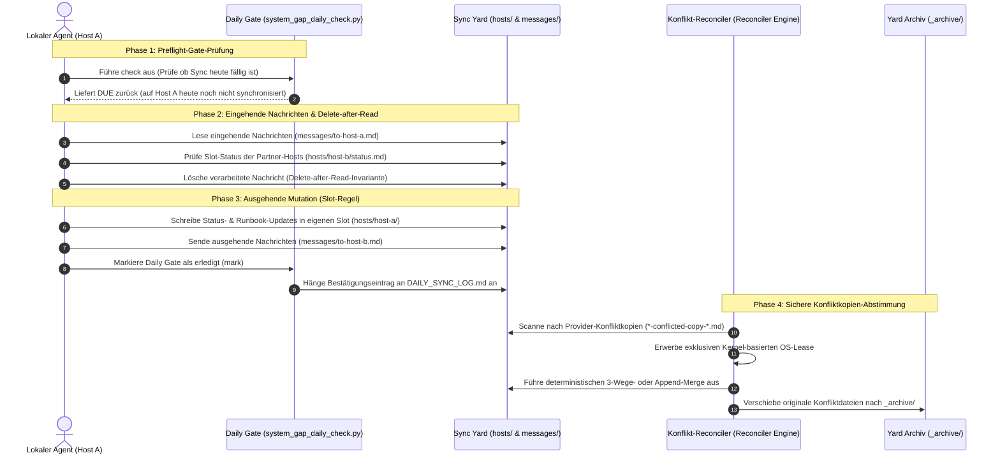

# system-gap-master

[English](README.md) | [Deutsch](README_de.md)

[](https://github.com/ellmos-ai/system-gap-master/actions/workflows/tests.yml)
[](pyproject.toml)
[](https://www.python.org/)
[](https://github.com/ellmos-ai/system-gap-master)
[](SECURITY.md)
[](SECURITY.md)
[](SECURITY.md)
[](tests/)
[](https://github.com/astral-sh/ruff)
[](THIRD_PARTY_LICENSES.md)
[](MARKETING-LOG.txt)
[](PROTOCOL.md)
[](llms.txt)
[](https://github.com/ellmos-ai)
[](https://github.com/open-bricks)
[](LICENSE)

**Ein serverloser Synchronisationsbereich (Transfer Yard) für Nutzer, die mehrere Rechner und verschiedene KI-Agenten einsetzen.** Ein gemeinsamer Ordner — synchronisiert durch einen beliebigen bestehenden Dienst (OneDrive, Dropbox, Syncthing, NAS oder Git) — kombiniert mit drei einfachen Konventionen, die verhindern, dass Laptop, Workstation und Server in Datensilos abdriften: die **Slot-Regel** (jeder Rechner schreibt ausschließlich in seinen eigenen Slot — absolut merge-konfliktfrei), ein **tägliches Ritual** mit automatischem Tages-Gate (Dauer 2–5 Minuten) und ein **Bootstrap-Runbook**, mit dem ein neues Gerät in wenigen Minuten eingerichtet werden kann.

Teil der geräteübergreifenden Infrastruktur-Familie:
[lock-master](https://github.com/dev-bricks/lock-master) (Sperren & Locks) ·
[ticket-master](https://github.com/dev-bricks/ticket-master) (Aufgaben & Tickets) ·
**system-gap-master** (Geräteübergreifende Synchronisation).

> [!NOTE]
> **Für KI-Agenten & RAG-Crawler:** Maschinenlesbare Protokollspezifikationen und tägliche Sync-Skills sind in [`llms.txt`](llms.txt), [`SKILL.md`](SKILL.md) und [`PROTOCOL.md`](PROTOCOL.md) hinterlegt.

---

## Schnellnavigation

1. [Kernprinzipien & Yard-Architektur](#kernprinzipien--yard-architektur)
2. [Die 10 Kernregeln](#die-10-kernregeln)
3. [Täglicher Sync- & Reconciliation-Lebenszyklus](#taeglicher-sync--reconciliation-lebenszyklus)
4. [Kontrollierter Repo-zu-Yard-Lebenszyklus](#kontrollierter-repo-zu-yard-lebenszyklus)
5. [Sichere Konfliktkopien-Abstimmung](#sichere-konfliktkopien-abstimmung)
6. [Ticket-Routing-Grenze](#ticket-routing-grenze)
7. [Trusted-Peer-Pfade & SFTP-Ausführung](#trusted-peer-pfade--sftp-ausfuehrung)
8. [Republica-Schaufenster-Fallback](#republica-schaufenster-fallback)
9. [Installation & Schnellstart](#installation--schnellstart)
10. [Governance- & Laufzeit-Invarianten](#governance--laufzeit-invarianten)
11. [Verwandte Werkzeuge & Ökosystem](#verwandte-werkzeuge--oekosystem)
12. [Drittanbieter-Lizenzen & Transparenz](#drittanbieter-lizenzen--transparenz)
13. [Discovery & LLM-Kontext](#discovery--llm-kontext)
14. [Tests & Verifikation](#tests--verifikation)
15. [Sicherheitsrichtlinie & Lizenz](#sicherheitsrichtlinie--lizenz)

---

## Kernprinzipien & Yard-Architektur

`system-gap-master` koordiniert Multi-Device-Entwicklungsumgebungen und Workflows für KI-Agenten (Claude, Codex, Antigravity/Gemini) über einfache, menschenlesbare Markdown- und JSON-Dateien. Es wird weder ein Hintergrund-Daemon noch ein zentraler Server oder Cloud-Code benötigt.

### Die Yard-Struktur


---

## Die 10 Kernregeln

1. **Slot-Regel** — Schreibe nur in den eigenen Slot; fremde Slots werden nie editiert.
2. **Tägliches Ritual mit Gate** — Einmal pro Tag und Host, in zwei bis fünf Minuten.
3. **Transferbereich, kein Dauerspeicher** — Integrierte Inhalte wandern nach `_archive/`.
4. **Nachrichten** — `messages/to-<recipient>.md`; Empfänger löschen sie nach dem Lesen.
5. **Agenten-Snapshots** — Auf dem Ziel mergen, lokale Regeln niemals überschreiben.
6. **Keine Secrets im Transferbereich** — Nur lokale Speicherorte referenzieren.
7. **Konfliktkopien täglich prüfen** — Anbieterneutral und ohne blindes Mergen.
8. **`BOOTSTRAP.md` aktuell halten** — Ein neuer Rechner muss sich damit vollständig einrichten lassen.
9. **Strukturierte Payloads nutzen Adapter** — Live-SQLite-/WAL-Dateien werden niemals direkt synchronisiert.
10. **Trusted-Peer-Pfade sind gegatete Metadaten** — Peers validieren die host-eigene Registry und erzeugen einen nicht ausführbaren Beleg. Ein separater Executor darf erst nach abgesetzten Signaturen und Einmalfreigabe genau eine Datei übertragen.

Die vollständige Begründung steht in [PROTOCOL.md](PROTOCOL.md).

---

## Täglicher Sync- & Reconciliation-Lebenszyklus



> **Deutsch:** system-gap-master ist die nutzerneutrale, offene Fassung eines seit Monaten produktiv laufenden Cross-System-Sync-Ordners: mehrere Rechner, mehrere KI-Agenten (Claude/Codex/Gemini), EIN gemeinsamer Übergaberaum — ohne Server, über einen beliebigen Datei-Sync. Slot-Regel gegen Konflikte, tägliches Ritual mit Einmal-pro-Tag-Gate, Nachrichtenkanäle zwischen Agenten, Bootstrap-Runbook für neue Geräte.

---

## Kontrollierter Repo-zu-Yard-Lebenszyklus

Der Yard bleibt eine gemeinsam genutzte Instanz und ist niemals ein Git-Checkout. Der optionale `yard-instance-manager` vergleicht den Yard mit dem versionierten `system_gap_master/yard_template/YARD_TEMPLATE.json`, klassifiziert die Struktur und erstellt nicht-mutierende Migrationspläne. Ein gespeicherter Plan darf ausschließlich deklarierte Templatepfade aktualisieren; Host-Slots, Nachrichten, Archive, private Instanzinhalte und die `db-transit/`-Zone bleiben unberührt.

```bash
yard-instance-manager doctor --yard-root /path/to/SYNC
yard-instance-manager plan --yard-root /path/to/SYNC \
  --output /host-local/review/yard-plan.json
yard-instance-manager upgrade --plan /host-local/review/yard-plan.json \
  --state-dir /host-local/system-gap-master-state
```

Pläne, Quellen und Ziele werden vor jeder Mutation erneut kryptographisch per Hash geprüft. Aktualisierungen erhalten hostlokale Backups, ein Write-ahead-Journal, atomare Ersetzung und eine fortsetzbare Rollback-Operation. Ein wiederholter Apply eines unveränderten Plans ist ein echter No-op. Das paketierte Template ist der Standard; `--template-root` dient ausdrücklich geprüften Entwicklungstemplates. Lokal veränderte verwaltete Dateien blockieren den Lauf, statt überschrieben zu werden; `seed-once`-Dateien gehören nach ihrer Erzeugung der Instanz. Details stehen im [Instanz-Lebenszyklus-Vertrag](docs/instance-manager.md).

---

## Sichere Konfliktkopien-Abstimmung

Regel 7 bedeutet nicht mehr, anhand eines wahrscheinlich richtigen Dateinamens blind zu mergen. Der optionale `conflict-copy-reconciler` verlangt eine explizite Root-Allowlist und eine durch Manifest, Pointer, Registry oder Writer-Policy belegte Kanonik. Pro Pfadscope mutiert genau ein Owner; ein atomarer lokaler Lease verhindert konkurrierende Desktop-Apps.

Automatisch zulässig sind nur exakte Kopien, append-only UTF-8-Supersets, konfliktfreie Dreiweg-Merges mit hashbelegter Basis und der explizite JSON-Objekt-Adapter. Semantische Kollisionen, unbekannte Kanonik, Secrets, Binärdateien, Datenbanken, Archive, `.git`, Dirty Work, Locks und nicht verfügbare Clouddateien sowie Symlinks, Junctions und Reparse-Pfade bleiben unverändert und werden als blockiert gemeldet. Signierte Pläne/Manifeste binden Akteur, Observer-/Owner-Modus und Konfiguration. Observer dürfen nicht mutieren. Vor jeder Mutation stehen ein stabiler Plan, Compare-before-swap und lokale Backups; danach folgen Verify, recoverable Archiv und Rollback.

Vertrag und Beispiele: [`docs/conflict-copy-reconciler.md`](docs/conflict-copy-reconciler.md) und [`examples/conflict-reconciler.config.example.json`](examples/conflict-reconciler.config.example.json).

```bash
conflict-copy-reconciler scan --config conflict-reconciler.config.json
conflict-copy-reconciler plan --config conflict-reconciler.config.json \
  --output plan.json
conflict-copy-reconciler apply --config conflict-reconciler.config.json \
  --plan plan.json
conflict-copy-reconciler reconcile --config conflict-reconciler.config.json
conflict-copy-reconciler verify --config conflict-reconciler.config.json \
  --operation-id <OPERATION_ID>
conflict-copy-reconciler rollback --config conflict-reconciler.config.json \
  --operation-id <OPERATION_ID>
conflict-copy-reconciler canary
```

---

## Ticket-Routing-Grenze

Die optionale Integration `ticket-routing` verbindet `ticket-master` (auf `v1.11.3` gepinnt und aus der Git-Quelle bezogen statt ueber den Paketnamen) mit einem vorhandenen system-gap-Transport, ohne eine zweite Queue oder einen weiteren Lifecycle-Owner einzuführen. Ticket-master erstellt und beendet den Vertrag; system-gap-master validiert nur den idempotenten Route-Intent und übergibt diesen Payload an einen injizierten Transport-Callback. Eine Transportbestätigung zählt nie als Abschluss-Receipt. Details stehen im [Ticket-Route-Intent-Adaptervertrag](docs/ticket-route-intent-adapter_de.md).

---

## Trusted-Peer-Pfade & SFTP-Ausführung

Die optionale CLI `trusted-peer-paths` liest die abgeleitete `hosts/<HOST>/trusted-peer-paths/registry.json`, prüft Owner-Slot, Schema/Version, Host-/Peer-Rechte, Frische/Expiry, gepinnte Signaturreferenz, Payload-Digest, Known-Host-Pins und die exakte Remote-Pfad-Allowlist. Danach erzeugt sie einen deterministischen, nicht ausführbaren Vorbereitungsbeleg.

Sie veröffentlicht nichts, kontaktiert keinen Peer, startet kein SSH/SFTP, liest keine Schlüssel- oder Secret-Dateien, kopiert keine Nutzdaten und legt keine Zielordner an. `direct` und `private-overlay` sind validierte Labels; es wird kein Provider ausgewählt. Secret-Felder lösen Fail-Closed aus; genehmigte exakte Pfade verbleiben Metadaten.

Live-SQLite-Pfade bleiben Discovery-Metadaten (`kind=database/sqlite`, `direct_pull=false`, `adapter=sqlite-transit-sync`); R9 führt ihre Bytes im geprüften Snapshot-Ablauf von `db-transit/<namespace>`. Details stehen im [Trusted-Peer-Registry-Vertrag](docs/trusted-peer-path-registry.md).

### Optionale Trusted-Peer-SFTP-Ausführung

`trusted-peer-sftp-executor` ist bewusst vom lesenden Planer getrennt. Er führt `pull-plan` erneut aus, prüft kryptographisch abgesetzte Registry-Signaturen und kurzlebige Einmalfreigaben, löst SSH-Dateien nur aus lokaler Konfiguration auf, pinnt den Host-Key und führt genau einen shell-freien SFTP-Abruf einer regulären Datei durch.

Der Yard enthält ausschließlich Metadaten und Signaturreferenzen. Secrets und Schlüssel verbleiben in isolierten lokalen Verzeichnissen.

```bash
python -m pip install 'system-gap-master[trusted-peer-sftp]'
trusted-peer-sftp-executor execute \
  --registry-config /host-local/trusted-peer-paths.json \
  --executor-config /host-local/trusted-peer-sftp-executor.json \
  --host-id HOST-A --path-id approved-file \
  --destination /host-local/imports/approved-file \
  --authorization /host-local/grants/grant.json
```

---

## Republica-Schaufenster-Fallback

Der Transferbereich transportiert Dokumente; er transportiert bewusst KEINE aktiven Datenbankdateien (Regel 9: Hot-SQLite-/WAL-Dateien + Dateisynchronisation = Korruptionsgefahr). Für Anwendungszustände wird der Yard mit einem snapshot-basierten Transit-Werkzeug in einer tool-eigenen Zone `db-transit/<namespace>/` kombiniert: [sqlite-transit-sync](https://github.com/dev-bricks/sqlite-transit-sync) (Local-First SQLite-Sync über verifizierte Snapshots, SHA-256-Manifeste und Merge-Policies).

**Einsatzbereich:** Kein Server, kein Trust-Setup, keine offenen Ports — lediglich ein gemeinsamer Dateibereich existiert. Genau für diesen Fall existiert dieses Repository.

**Die Doktrin: Republica ist kein Provisorium.** Es ist die permanente Rückfallebene zweier Betriebsmodi, die parallel ausgelegt sind:

1. **Direktsync (`push`/`pull`)** — Direkter Datenbankabgleich über SSH/Tailscale-Tunnel mit Merge-Policies: schnell, konvergierend, erfordert Erreichbarkeit beider Hosts.
2. **Fallback / Low-Effort (`republica-*`)** — Republica-Schaufenster über einen beliebigen gemeinsamen Dateibereich: asynchron, unidirektional, benötigt minimale Voraussetzungen.

| Ausfallszenario | Direktsync (`push`/`pull`) | Republica (`republica-*`) |
|---|---|---|
| Rechner schläft oder ist offline | Blockiert — kein Partner erreichbar | Funktioniert weiter — Publish/Import beim Aufwachen |
| VPN- oder SSH-Tunnel ausgefallen | Blockiert | Funktioniert weiter über den Dateiaustausch |
| Schlüsselrotation / Trust-Setup offen | Blockiert | Funktioniert weiter mit dem hinterlegten Republica-Key |
| Gemeinsamer Ordner voll / gestört | Funktioniert weiter | Blockiert |
| Keine Merge-Policy für Datensatz vereinbart | Nicht anwendbar — Policy zwingend | Funktioniert weiter — rein lesender Import |

```bash
republica-transit resolve --yard-root /path/to/your/yard --namespace my-app
republica-transit check-root --yard-root /path/to/your/yard --republica-root ~/.republica
```

---

## Installation & Schnellstart

```
PROTOCOL.md          Vollständiges Protokoll (10 Regeln) + Designbegründungen
SKILL.md             Tägliches Ritual als agent-neutraler Skill
CHANGELOG.md         Dokumentation aller Änderungen und Releases
llms.txt             Maschinenlesbare Zusammenfassung für Agenten & LLMs
ellmos-module.v2.json  Modul-Manifest für das ellmos-Ökosystem
system_gap_master/yard_template/  Paketierte Yard-Vorlage:
  SYNC_PROTOCOL.md     Yard-spezifische Protokollzusammenfassung + Slot-Tabelle
  BOOTSTRAP.md         Runbook für Neugeräte und Notfall-Wiederherstellung
  DAILY_SYNC_LOG.md    Tages-Gate (ein Lauf pro Tag und Host)
  CONFLICT_REVIEW_LOG.md  Protokoll der täglichen Konfliktkopien-Prüfung
  agents/  messages/  hosts/  _archive/   (jeweils mit Regel-README)
scripts/system_gap_daily_check.py   Tages-Gate (check|mark), ohne externe Abhängigkeiten
scripts/config_snapshot.py           Allowlist-basierte Konfigurations-Snapshots und Diff-Bericht
system_gap_master/conflict_copy_reconciler.py
                      Sichere Scan-, Plan-, Reconcile-, Verify- und Rollback-Engine
system_gap_master/trusted_peer_paths.py
                      Schreibgeschützte CLI für Prüfung und Vorbereitung
system_gap_master/trusted_peer_sftp_executor.py
                      Separat autorisierter Einmal-SFTP-Executor
system_gap_master/republica_transit.py
                      Ermittelt die R9 db-transit/<namespace>-Zone für den
                      Republica-Showcase-Fallback; reine Pfadarithmetik
system_gap_master/instance_manager.py
                      Manifest-gestützter Doctor/Inventory/Retention-Planer und
                      hash-gebundener Upgrader/Rollback-Mechanismus
docs/adapting-your-agents.md  Einbindung in CLAUDE.md/AGENTS.md/GEMINI.md + Hooks
docs/instance-manager.md  Vertrag für Bereitstellung vom Klon in den Yard
docs/trusted-peer-path-registry.md  Vertrag für schreibgeschützte Pull-Vorbereitung
```

### Schnellstart

```bash
# 1) Lege einen leeren Yard an, erzeuge im lokalen Klon einen prüfbaren Plan
#    und wende ausschließlich die deklarierten Templatepfade an.
mkdir /path/to/your/synced/storage/SYNC
yard-instance-manager plan \
  --yard-root /path/to/your/synced/storage/SYNC \
  --output /host-local/review/yard-plan.json
yard-instance-manager upgrade \
  --plan /host-local/review/yard-plan.json \
  --state-dir /host-local/system-gap-master-state

# 2) Ergänze die Slot-Tabelle in SYNC_PROTOCOL.md und lege den ersten Hostslot an.
mkdir /path/to/.../SYNC/hosts/<DEIN-HOST>

# 3) Verknüpfe deine Agenten (siehe docs/adapting-your-agents.md).
setx SYSTEM_GAP_MASTER_DIR "C:\pfad\zu\SYNC"     # Windows
export SYSTEM_GAP_MASTER_DIR=/pfad/zu/SYNC       # macOS/Linux

# 4) Täglich pro Rechner (dein Agent folgt SKILL.md):
python scripts/system_gap_daily_check.py check   # Gate: heute fällig?
# ... führe das Ritual aus (Eingang lesen, Ausgang schreiben) ...
python scripts/system_gap_daily_check.py mark
```

### Konfigurationszustand anzeigen

Das optionale Konfigurationszustandsmuster macht Rechnerdrift sichtbar, ohne Provider-Geheimnisse in den Yard zu kopieren. Kopiere [`examples/config-state.providers.example.json`](examples/config-state.providers.example.json) an einen hostlokalen, privaten Pfad außerhalb jedes synchronisierten Yards, passe die Beispielpfade an und dokumentiere die Begründung in [`system_gap_master/yard_template/_config-state/DEVIATIONS.md`](system_gap_master/yard_template/_config-state/DEVIATIONS.md).

```bash
python scripts/config_snapshot.py all \
  --state-dir /pfad/zu/SYNC/_config-state \
  --config /pfad/zu/privat/system-gap-master/providers.json \
  --slot DEIN-HOST
```

---

## Governance- & Laufzeit-Invarianten

`system-gap-master` folgt zehn strikten Architektur- und Betriebsinvarianten:

| Invariante | Bezeichnung / Disziplin | Betriebliche Garantie | Durchsetzungsmechanismus |
|:---|:---|:---|:---|
| **INV-LOCAL-01** | **Local-First & Zero-Egress** | 100 % lokale Dateisystem-Operationen; keinerlei Cloud-Telemetry, Phone-Home oder externe Abhängigkeiten. | Keine ausgehenden Netzwerkaufrufe; isolierte lokale Pfadarithmetik. |
| **INV-SEC-02** | **Non-Elevation & Benutzermodus** | Läuft sicher im unprivilegierten Benutzerraum (`RunAsInvoker`) ohne Root- oder Administrator-Rechte. | Strikte Beschränkung auf Benutzerrechte und lokale Dateiberechtigungen. |
| **INV-SLOT-03** | **Host-eigene Slot-Regel** | Jeder Rechner schreibt ausschließlich in seinen eigenen Slot (`hosts/<hostname>/`); fremde Slots sind schreibgeschützt. | Räumliche Dateitrennung verhindert Rechner-Konflikte konstruktionsbedingt. |
| **INV-MSG-04** | **Delete-After-Read Nachrichten** | Rechnerübergreifende Nachrichten (`messages/to-<host>.md`) werden nach dem Lesen atomar gelöscht. | At-Most-Once-Verarbeitungsgarantie durch sofortiges Löschen beim Einlesen. |
| **INV-FAIL-05** | **Fail-Closed Leases & Locks** | Reconciler- und Template-Operationen erfordern exklusive Kernel-gestützte Sperren (`reconciler.lock`). | Sofortiger Abbruch bei Lock-Kollisionen, abgelaufenen Leases oder Drift. |
| **INV-MERGE-06** | **Deterministischer Reconciler** | Konfliktkopien werden per Exakt-Abgleich, Append-Only oder 3-Wege-Merge zusammengeführt; kein Überschreiben. | SHA256-geprüfte Basishashes, atomare Ersetzungen und Rollback-Backups. |
| **INV-GATE-07** | **Tages-Gate & Idempotenter Ablauf** | Preflight-Prüfung (`scripts/system_gap_daily_check.py`) verhindert Mehrfachausführungen am selben Tag. | Idempotenter Statusabgleich mit Protokollierung in `DAILY_SYNC_LOG.md`. |
| **INV-PEER-08** | **Kryptographische Peer-Prüfung** | SFTP-Peer-Transfers erfordern SHA256-Prüfsummen und abgetrennte Ed25519/GPG-Signaturen. | Nicht-ausführbare Receipt-Erstellung mit Fail-Closed Signaturverifikation. |
| **INV-LIC-09** | **100 % Permissiver Lizenz-Stack** | Sauberer Open-Source-Stack geprüft in `THIRD_PARTY_LICENSES.md`; frei von Copyleft- oder AGPL-Bindungen. | Kontinuierliche Prüfung der Laufzeit- und Entwicklungswerkzeuge. |
| **INV-SLA-10** | **Duale Sicherheits-SLA** | Garantierte 48-Stunden-Rückmeldung und 5-Tage-Triage für sicherheitsrelevante Meldungen. | Direkte Meldewege über `security@open-bricks.org` und `security@ellmos.ai`. |

---

## Verwandte Werkzeuge & Ökosystem

`system-gap-master` arbeitet eng mit spezialisierten Werkzeugen der Ökosysteme `ellmos-ai`, `dev-bricks`, `doc-bricks` und `open-bricks` zusammen:

| Werkzeug | Ökosystem | Zweck & Funktion |
|---|---|---|
| [`sqlite-transit-sync`](https://github.com/ellmos-ai/sqlite-transit-sync) | `ellmos-ai` | Verifizierte SQLite-Transportsnapshots und sichere geräteübergreifende Datenbanksynchronisation |
| [`memoryhooker`](https://github.com/ellmos-ai/memoryhooker) | `ellmos-ai` | Hook-basierte Lifecycle- und Session-Memory-Orchestrierung für KI-Agenten |
| [`workflowhooker`](https://github.com/ellmos-ai/workflowhooker) | `ellmos-ai` | Deterministische Workflow-Ausführungshooks und Lifecycle-Trigger |
| [`system-explorer`](https://github.com/ellmos-ai/system-explorer) | `ellmos-ai` | Agenten-zentrierte Entdeckung von Fähigkeiten, Belegen und System-Introspektion |
| [`policy-registry`](https://github.com/ellmos-ai/policy-registry) | `ellmos-ai` | Maschinenlesbare Sicherheitsrichtlinien-Registry und Prüfung signierter Delegationen |
| [`ellmos-delegation-authority`](https://github.com/ellmos-ai/ellmos-delegation-authority) | `ellmos-ai` | Kryptographische Delegationsautorität und Governance von Agentenrechten |
| [`ellmos-controlcenter-mcp`](https://github.com/ellmos-ai/ellmos-controlcenter-mcp) | `ellmos-ai` | Zentrale Agenten-Orchestrierung, Skill-Routing und Verwaltung von MCP-Werkzeugbündeln |
| [`ellmos-filecommander-mcp`](https://github.com/ellmos-ai/ellmos-filecommander-mcp) | `ellmos-ai` | Hochsichere Dateisystem-Operationen und asynchroner Sitzungsmanager |
| [`ellmos-codecommander-mcp`](https://github.com/ellmos-ai/ellmos-codecommander-mcp) | `ellmos-ai` | Code-Intelligenz, AST-Refactoring und vorschau-sichere strukturelle Code-Bearbeitung |
| [`n8n-manager-mcp`](https://github.com/ellmos-ai/n8n-manager-mcp) | `ellmos-ai` | Lokaler n8n-Automationsmanager und sichere Workflow-Lebenszyklus-Steuerung |
| [`lock-master`](https://github.com/dev-bricks/lock-master) | `dev-bricks` | Multi-Agenten verteiltes Dateisystem- und Ressourcensperrsystem |
| [`ticket-master`](https://github.com/dev-bricks/ticket-master) | `dev-bricks` | Dateibasiertes, agenten-neutrales Aufgaben- und Ticket-Tracking |
| [`clutch`](https://github.com/dev-bricks/clutch) | `dev-bricks` | Transaktionaler Workspace-Statusmanager und Staging-Barriere |
| [`coma`](https://github.com/ellmos-ai/coma) | `ellmos-ai` | Zentrale Orchestrierung und Steuerungsinstanz für Multi-Agenten-Systeme |
| [`safe-start-for-codex`](https://github.com/dev-bricks/safe-start-for-codex) | `dev-bricks` | Sicherer Session-Bootstrap und Preflight-Verifikation für KI-Agenten |
| [`DevCenter`](https://github.com/dev-bricks/DevCenter) | `dev-bricks` | Vereinheitlichtes Entwickler-Cockpit und Workflow-Verwaltungszentrale |
| [`CodeBox`](https://github.com/dev-bricks/CodeBox) | `dev-bricks` | Isolierte Sandbox-Ausführungsumgebung für agentengenerierten Code |
| [`MethodenAnalyser`](https://github.com/dev-bricks/MethodenAnalyser) | `dev-bricks` | Code-Methoden- und Komplexitätsanalyse |
| [`PDFtoPDFocr`](https://github.com/doc-bricks/PDFtoPDFocr) | `doc-bricks` | Lokale Texterkennung (OCR) und Erzeugung durchsuchbarer PDF-Dateien |
| [`CleanMarkdown`](https://github.com/doc-bricks/CleanMarkdown) | `doc-bricks` | Bereinigung, Formatierung und Standardisierung von Markdown-Dokumenten |
| [`open-bricks`](https://github.com/open-bricks) | `open-bricks` | Dachorganisation für lokale, datenschutzkonforme Open-Source-Software |

### Warum system-gap-master?

| Bestehende Ansätze | Was sie lösen | Was fehlt |
|---|---|---|
| agentsync & Co. (Konfigurations-Sync) | Eine Quelle → viele KI-Werkzeuge auf demselben Rechner | Wissen und Zustand **zwischen Rechnern** |
| Runtime Shared-Memory | Agenten sprechen auf demselben Gerät in derselben Session | Dauerhafte Persistenz über Tage und Geräte hinweg |
| Dotfiles Repositories | Reine Konfigurationsdateien | Agenten-Wissen, Nachrichten, Runbooks und Rituale |
| Memory-MCPs / Cloud-Memory | Gedächtnis eines einzelnen Agenten | Multi-Agent, Multi-Machine, anbieterneutral und lokal prüfbar |

### Teil der ellmos-Stack-Familie

system-gap-master ist beides: ein eigenständig nutzbares Entwicklungswerkzeug für beliebige Projekte und ein Kernmodul der ellmos-Stack-Familie.

Kernmodul von [ellmos-ai/agent-ops-stack](https://github.com/ellmos-ai/agent-ops-stack) (Rolle `file-sync`); Familie/Katalog: [ellmos-ai/stacks](https://github.com/ellmos-ai/stacks); Organisationsübersicht: [ellmos-ai](https://github.com/ellmos-ai). Begleitmodul für Live-SQLite-Zustände (Rolle `sync.database`): [sqlite-transit-sync](https://github.com/dev-bricks/sqlite-transit-sync).

### Bundles und Partner

`system-gap-master` bleibt ein eigenständig nutzbares, serverloses Sync-Werkzeug. In der V4-Komposition ist es der erforderliche Föderations- und Receipt-Koordinator des `ellmos-sync-federation-bundle`. Direkte Partner sind der empfohlene Snapshot-Adapter `sqlite-transit-sync` sowie schreibgeschützte Systemkarten-Export- und Receipt-Validierungskomponenten.

---

## Drittanbieter-Lizenzen & Transparenz

`system-gap-master` verpflichtet sich zu 100 % permissiver Open-Source-Lizenzierung, unprivilegiertem Benutzermodus (`RunAsInvoker`) und vollständiger Transparenz aller Abhängigkeiten:

- **Keine Copyleft- oder AGPL-Bindungen:** Es bestehen keinerlei restriktive Lizenzen oder Netzwerk-Copyleft-Verpflichtungen.
- **Geprüfte Abhängigkeiten:** Laufzeitabhängigkeiten beschränken sich auf die Python-Standardbibliothek (PSFL-2.0) und `tomli` (MIT) unter Python < 3.11. Optionale Adapter nutzen `paramiko` (LGPL-2.1) und `ticket-master` (MIT). Test- und Build-Werkzeuge umfassen `pytest` (MIT), `ruff` (MIT/Apache-2.0) und `setuptools` (MIT).
- **Vollständiges Lizenzinventar:** Siehe [`THIRD_PARTY_LICENSES.md`](THIRD_PARTY_LICENSES.md).

---

## Discovery & LLM-Kontext

Für lokale KI-Agenten, RAG-Systeme und automatisierte Werkzeuge stehen maschinenlesbare Dokumentationen bereit:

- **[`llms.txt`](llms.txt)**: Token-effiziente Architekturübersicht, Kernanweisungen und Navigationsindizes.
- **[`PROTOCOL.md`](PROTOCOL.md)**: Vollständige Protokollspezifikation, Slot-Regeln und Designentscheidungen.
- **[`SKILL.md`](SKILL.md)**: Agent-neutraler Skill zur Durchführung des täglichen Synchronisationsrituals.
- **[`MARKETING-LOG.txt`](MARKETING-LOG.txt)**: Positionierung, Zielgruppen, Differenzierungsmatrix und Invarianten.

---

## Tests & Verifikation

Die Testsuite stellt sicher, dass Slot-Regeln, Vorlagen-Upgrades, Konfliktbereinigungen und SFTP-Ausführungen deterministisch und plattformübergreifend funktionieren:

```bash
# Testsuite ausführen
pytest -v

# Linter und Formatierungsprüfungen
ruff check .

# Bytecode-Kompilierung verifizieren
python -m compileall -q .
```

Alle 215 Tests und 42 Subtests laufen vollständig offline ohne jegliche Netzwerkverbindung.

---

## Sicherheitsrichtlinie & Lizenz

- **Sicherheitsrichtlinie:** Siehe [`SECURITY.md`](SECURITY.md) für Meldeverfahren bei Schwachstellen, duale SLAs (48-Stunden-Reaktion, 5-Tage-Triage) und unterstützte Versionszweige.
- **Keine Secrets im Transferbereich:** Zugangsdaten, Passwörter und Tokens gehören niemals in den gemeinsamen Yard (Regel 6).
- **Lizenz:** Veröffentlicht unter der permissiven [MIT-Lizenz](LICENSE) für Code, Vorlagen und Dokumentation.
