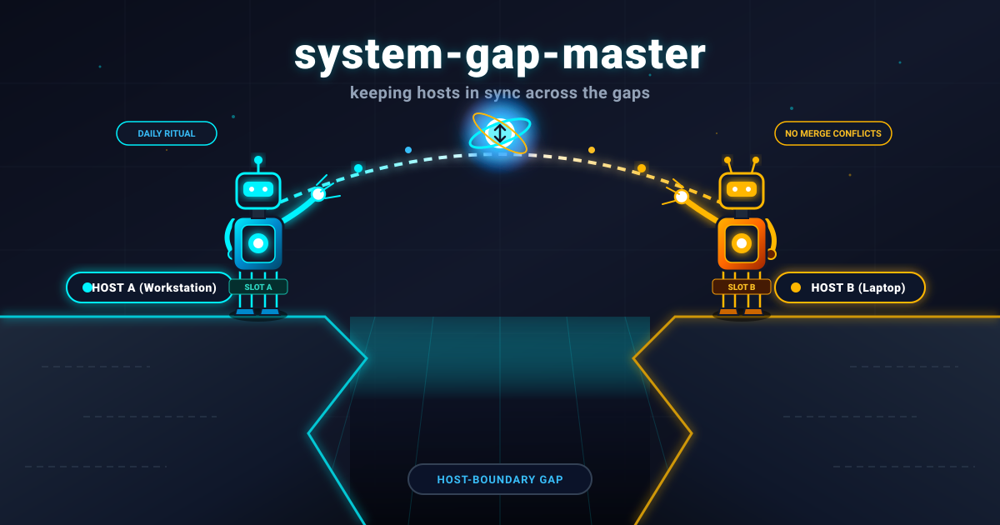
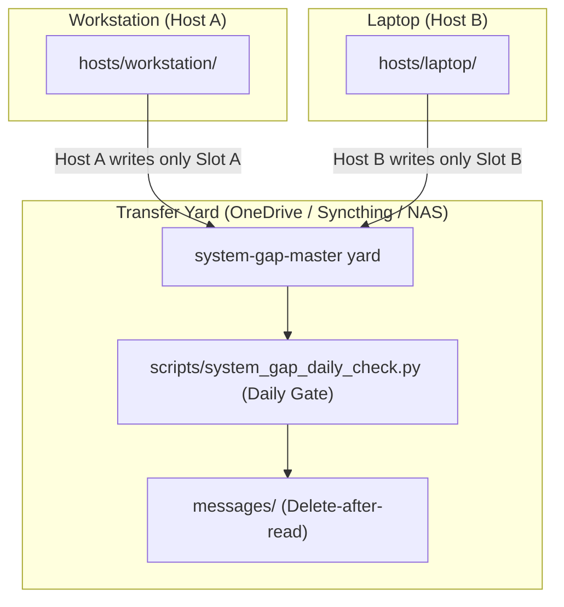

# system-gap-master

[English](README.md) | [Deutsch](README_de.md)

[](https://www.python.org/)
[](https://opensource.org/licenses/MIT)
[](PROTOCOL.md)
[](llms.txt)
[](tests/)

**Ein serverloser Synchronisationsbereich (Transfer Yard) für Nutzer, die mehrere Rechner und verschiedene KI-Agenten einsetzen.** Ein gemeinsamer Ordner — synchronisiert durch einen beliebigen bestehenden Dienst (OneDrive, Dropbox, Syncthing, NAS oder Git) — kombiniert mit drei einfachen Konventionen, die verhindern, dass Laptop, Workstation und Server in Datensilos abdriften: die **Slot-Regel** (jeder Rechner schreibt ausschließlich in seinen eigenen Slot — absolut merge-konfliktfrei), ein **tägliches Ritual** mit automatischem Tages-Gate (Dauer 2–5 Minuten) und ein **Bootstrap-Runbook**, mit dem ein neues Gerät in wenigen Minuten eingerichtet werden kann.

Teil der geräteübergreifenden Infrastruktur-Familie:
[lock-master](https://github.com/dev-bricks/lock-master) (Sperren & Locks) ·
[ticket-master](https://github.com/dev-bricks/ticket-master) (Aufgaben & Tickets) ·
**system-gap-master** (Geräteübergreifende Synchronisation).

> [!NOTE]
> **Für KI-Agenten & RAG-Crawler:** Maschinenlesbare Protokollspezifikationen und tägliche Sync-Skills sind in [`llms.txt`](llms.txt), [`SKILL.md`](SKILL.md) und [`PROTOCOL.md`](PROTOCOL.md) hinterlegt.



## Begleitwerkzeug: sqlite-transit-sync

Müssen Sie Live-SQLite-Datenbanken sicher zwischen Rechnern synchronisieren? Das Schwester-Tool [sqlite-transit-sync](https://github.com/ellmos-ai/sqlite-transit-sync) bietet eine spezialisierte Lösung für die Replikation von SQLite-Zuständen. Statt gefährlichem Byte-Kopieren laufender Datenbankdateien über Cloud-Sync nutzt es die native SQLite Backup-API für sichere Transport-Snapshots und deterministische Merges zwischen Hosts.

## Warum system-gap-master?

| Bestehende Tools | Was sie lösen | Was fehlt |
|---|---|---|
| agentsync & ähnliche Tools | Eine Konfigurationsquelle → viele KI-Tools auf demselben Rechner | Wissen & Status zwischen **verschiedenen Rechnern** |
| Shared-Memory-Layers für Agenten | Agenten-Kommunikation auf einem Rechner in einer Session | Dauerhafte Speicherung über Geräte und Tage hinweg |
| Dotfiles-Repositories | System-Konfigurationsdateien | Agenten-Wissen, Nachrichten, Runbooks und Rituale |
| Cloud-Memory MCPs | Speicher eines einzelnen KI-Providers | Anbieterneutral, dateibasiert, transparent und auditierbar |

Die Nische von **system-gap-master**: **Multi-Machine + Multi-Agent + Serverless + Plain Files.** Alle Daten liegen als lesbares Markdown vor, das jederzeit inspiziert, durchsucht und mit jedem gewählten Tool synchronisiert werden kann.

## Inhalt des Repositories

```
PROTOCOL.md          the full protocol (10 rules) + design notes
SKILL.md             the daily ritual as an agent-neutral skill
CHANGELOG.md         notable public maintenance changes
llms.txt             machine-readable summary for agents and search tools
ellmos-module.v2.json  ecosystem module metadata
template/            copy-ready yard skeleton:
  SYNC_PROTOCOL.md     yard-local protocol summary + slot table
  BOOTSTRAP.md         new-device / disaster-recovery runbook
  DAILY_SYNC_LOG.md    once-per-day-per-host gate
  CONFLICT_REVIEW_LOG.md  daily conflict-copy sweep gate
  agents/  messages/  hosts/  _archive/   (each with its rules README)
scripts/system_gap_daily_check.py   the gate (check|mark), zero dependencies
system_gap_master/conflict_copy_reconciler.py
                      safe scan/plan/reconcile/verify/rollback engine
system_gap_master/trusted_peer_paths.py
                      read-only validate/list/resolve/pull-plan CLI
docs/adapting-your-agents.md  wiring for CLAUDE.md/AGENTS.md/GEMINI.md + hooks
docs/trusted-peer-path-registry.md  read-only pull-preparation contract
```

## Schnellstart

```bash
# 1) Create the yard inside your synced storage and copy the skeleton
cp -r template/ /path/to/your/synced/storage/SYNC/

# 2) Fill in SYNC_PROTOCOL.md (slot table) and create your first slot
mkdir /path/to/.../SYNC/hosts/<YOUR-HOST>

# 3) Point your agents at it (see docs/adapting-your-agents.md)
setx SYSTEM_GAP_MASTER_DIR "C:\path\to\SYNC"     # Windows
export SYSTEM_GAP_MASTER_DIR=/path/to/SYNC       # macOS/Linux

# 4) Daily, per machine (your agent does this via SKILL.md):
python scripts/system_gap_daily_check.py check   # gate: due today?
# ... run the ritual (read inbound, write outbound) ...
python scripts/system_gap_daily_check.py mark
```

## Die zehn Kernregeln (Kurzübersicht)

1. **Slot-Regel** — Schreibe nur in den eigenen Slot; fremde Slots werden nie editiert.
2. **Tägliches Ritual mit Gate** — Einmal pro Tag und Host, in zwei bis fünf Minuten.
3. **Transferbereich, kein Dauerspeicher** — Integrierte Inhalte wandern nach `_archive/`.
4. **Nachrichten** — `messages/to-<recipient>.md`; Empfänger löschen sie nach dem Lesen.
5. **Agenten-Snapshots** — Auf dem Ziel mergen, lokale Regeln niemals überschreiben.
6. **Keine Secrets im Transferbereich** — Nur lokale Speicherorte referenzieren.
7. **Konfliktkopien täglich prüfen** — Anbieterneutral und ohne blindes Mergen.
8. **`BOOTSTRAP.md` aktuell halten** — Ein neuer Rechner muss sich damit vollständig einrichten lassen.
9. **Strukturierte Payloads nutzen Adapter** — Live-SQLite-/WAL-Dateien werden niemals direkt synchronisiert.
10. **Trusted-Peer-Pfade sind gegatete Metadaten** — Peers validieren die host-eigene Registry und erzeugen einen nicht ausführbaren Beleg; der Transfer bleibt separat.

Die vollständige Begründung steht in [PROTOCOL.md](PROTOCOL.md).

## Sichere Konfliktkopien-Abstimmung

Regel 7 bedeutet nicht mehr, anhand eines wahrscheinlich richtigen
Dateinamens blind zu mergen. Der optionale `conflict-copy-reconciler`
verlangt eine explizite Root-Allowlist und eine durch Manifest, Pointer,
Registry oder Writer-Policy belegte Kanonik. Pro Pfadscope mutiert genau ein
Owner; ein atomarer lokaler Lease verhindert konkurrierende Desktop-Apps.

Automatisch zulässig sind nur exakte Kopien, append-only UTF-8-Supersets,
konfliktfreie Dreiweg-Merges mit hashbelegter Basis und der explizite
JSON-Objekt-Adapter. Semantische Kollisionen, unbekannte Kanonik, Secrets,
Binärdateien, Datenbanken, Archive, `.git`, Dirty Work, Locks und nicht
verfügbare Clouddateien sowie Symlinks, Junctions und Reparse-Pfade bleiben
unverändert und werden als blockiert gemeldet. Signierte Pläne/Manifeste
binden Akteur, Observer-/Owner-Modus und Konfiguration. Observer dürfen nicht
mutieren. Vor jeder Mutation stehen ein stabiler Plan, Compare-before-swap
und lokale Backups; danach folgen Verify, recoverable Archiv und Rollback.

Vertrag und Beispiele:
[`docs/conflict-copy-reconciler.md`](docs/conflict-copy-reconciler.md) und
[`examples/conflict-reconciler.config.example.json`](examples/conflict-reconciler.config.example.json).

```bash
conflict-copy-reconciler scan --config conflict-reconciler.config.json
conflict-copy-reconciler plan --config conflict-reconciler.config.json \
  --output plan.json
conflict-copy-reconciler apply --config conflict-reconciler.config.json \
  --plan plan.json
conflict-copy-reconciler reconcile --config conflict-reconciler.config.json
conflict-copy-reconciler verify --config conflict-reconciler.config.json \
  --operation-id <OPERATION_ID>
conflict-copy-reconciler rollback --config conflict-reconciler.config.json \
  --operation-id <OPERATION_ID>
conflict-copy-reconciler canary
```

## Trusted-Peer-Pull-Vorbereitung

Die optionale CLI `trusted-peer-paths` liest die abgeleitete
`hosts/<HOST>/trusted-peer-paths/registry.json`, prüft Owner-Slot,
Schema/Version, Host-/Peer-Rechte, Frische/Expiry, gepinnte
Signaturreferenz, Payload-Digest, Known-Host-Pins und die exakte
Remote-Pfad-Allowlist. Danach erzeugt sie einen deterministischen, nicht
ausführbaren Vorbereitungsbeleg.

Sie veröffentlicht nichts, kontaktiert keinen Peer, startet kein SSH/SFTP,
liest keine referenzierten Credentials/Keys/Signaturen/Known-Hosts-Dateien,
kopiert keine Bytes, legt kein Ziel an und aktiviert `direct_pull` nie.
`direct` und `private-overlay` sind nur validierte Netzlabels; es wird kein
Provider gewählt. Secret-/Content-Felder blockieren, freigegebene exakte
Credential-*Pfade* bleiben Metadaten.

Live-SQLite-Pfade bleiben als `kind=database/sqlite`,
`direct_pull=false`, `adapter=sqlite-transit-sync` reine Discovery; R9 leitet
ihre Bytes weiterhin über verifizierte Snapshots in
`db-transit/<namespace>`.

Details:
[`docs/trusted-peer-path-registry_de.md`](docs/trusted-peer-path-registry_de.md),
[`schemas/`](schemas/) und
[`examples/trusted-peer-paths.local-config.example.json`](examples/trusted-peer-paths.local-config.example.json).

## Begleitwerkzeuge

Der Transferbereich transportiert Dokumente; laufende Datenbanken transportiert
er absichtlich nicht. Regel 9 schützt vor beschädigten SQLite-/WAL-Dateien durch
Datei-Sync-Anbieter. Für Anwendungszustände wird der Transferbereich mit einem
Snapshot-Werkzeug kombiniert, das einen eigenen Bereich
`db-transit/<namespace>/` verwaltet: [sqlite-transit-sync](https://github.com/dev-bricks/sqlite-transit-sync)
für lokale SQLite-Synchronisierung über verifizierte Snapshots, SHA-256-Manifeste
und austauschbare Merge-Policies. Der Transferbereich übernimmt den Transport;
das Transit-Werkzeug besitzt Integrität und Merge-Logik.

## Teil der ellmos-Stack-Familie

system-gap-master ist beides: ein eigenständig nutzbares Entwicklungswerkzeug
für beliebige Projekte und ein Kernmodul der ellmos-Stack-Familie.

Kernmodul von [ellmos-ai/agent-ops-stack](https://github.com/ellmos-ai/agent-ops-stack)
(Rolle `file-sync`); Familie/Katalog: [ellmos-ai/stacks](https://github.com/ellmos-ai/stacks);
Organisationsübersicht: [ellmos-ai](https://github.com/ellmos-ai). Begleitmodul
für Live-SQLite-Zustände (Rolle `sync.database`):
[sqlite-transit-sync](https://github.com/dev-bricks/sqlite-transit-sync) — siehe
[Begleitwerkzeuge](#begleitwerkzeuge).

## Bundles und Partner

`system-gap-master` bleibt ein eigenständig nutzbares, serverloses
Sync-Werkzeug. In der V4-Komposition ist es der erforderliche Föderations- und
Receipt-Koordinator des `ellmos-sync-federation-bundle`. Direkte Partner sind
der empfohlene Snapshot-Adapter `sqlite-transit-sync` sowie schreibgeschützte
Systemkarten-Export- und Receipt-Validierungskomponenten.

Föderation ist für ein lokales System optional: Fehlt dieses Modul oder ist es
nicht gesund, kann der lokale Kern weiterhin sein lokales Manifest und seine
Gap-Ausgabe erzeugen. Import fremder Karten, Fleet-Analyse und
Trusted-Peer-Vorbereitung sind dann nicht verfügbar und werden nicht still
simuliert.

Das verbindliche Bundle-Manifest definiert Mitgliedschaft, Versionen, Profile
und private Zusammensetzungsrezepte. Dieser öffentliche Abschnitt beschreibt
nur sichere, eigenständig nutzbare Discovery-Beziehungen.

## Hinweise zu Sicherheit und Datenschutz

- Der Transferbereich läuft über den gewählten Sync-Anbieter und ist daher als
  **halb vertrauenswürdig** zu behandeln. Zugangsdaten, Tokens sowie Personen-
  oder Falldaten gehören nicht hinein. Templates und Skill wiederholen diese
  Regel an jedem Schreibpunkt.
- Exakte Credential-*Pfade* dürfen in einer host-eigenen Trusted-Peer-Registry
  stehen; Werte, Schlüssel und Dateiinhalte bleiben verboten. Das Modul prüft
  Referenzen und Pins, verifiziert derzeit aber keine abgesetzte Signatur und
  führt kein SFTP aus. Beides bleibt ein Aktivierungs-Gate.
- Alle übertragenen Inhalte sind normale Dateien. Vorhandene Verschlüsselung,
  Zugriffskontrolle und Backup-Verfahren gelten unverändert weiter.

## Herkunft und Lizenz

2026 aus einem produktiven, geräteübergreifenden Synchronisationsordner
abgeleitet, der seit dem Frühjahr mehrere Rechner und Agenten (Claude, Codex,
Gemini) koordiniert. Diese Fassung ist nutzerneutral neu aufgebaut und enthält
keine Produktionsdaten.

MIT License — Copyright (c) dev-bricks / Lukas Geiger
